# Application Mobile d'Escalade - Fullstack Architecture Document

This document outlines the complete fullstack architecture for the **Application Mobile d'Escalade**, including backend systems (Supabase), frontend implementation (React Native), and their integration. It serves as the single source of truth for AI-driven development, ensuring consistency across the entire technology stack.

This unified approach combines what would traditionally be separate backend and frontend architecture documents, streamlining the development process for this mobile application where Supabase handles the entire backend layer.

## Starter Template or Existing Project

**N/A - Greenfield project**

Ce projet est créé from scratch avec les choix technologiques suivants définis dans le PRD :

- **Frontend:** React Native avec Expo (managed workflow)
- **Backend:** Supabase (BaaS) - PostgreSQL, Auth, Storage, RLS
- **Monitoring:** Firebase Crashlytics

Aucun starter template n'est imposé. L'architecture sera conçue pour maximiser la simplicité du MVP tout en permettant l'évolution vers V2.

## Change Log

| Date       | Version | Description   | Author              |
| ---------- | ------- | ------------- | ------------------- |
| 2026-01-07 | 0.1     | Draft initial | Winston (Architect) |

---

## High Level Architecture

### Technical Summary

Cette application mobile d'escalade utilise une architecture **BaaS (Backend-as-a-Service)** avec Supabase comme backend tout-en-un, éliminant le besoin d'un serveur custom. Le frontend React Native avec Expo communique directement avec les APIs auto-générées de Supabase (REST/PostgREST). La sécurité est assurée par Row Level Security (RLS) au niveau PostgreSQL, permettant une logique d'autorisation déclarative par rôle (Invité, Utilisateur, Admin). Cette architecture serverless garantit un coût nul pour le MVP (free tier) tout en offrant une scalabilité native pour V2.

### Platform and Infrastructure Choice

**Platform:** Supabase Cloud (Free Tier)

**Rationale:** Le PRD impose explicitement Supabase pour respecter la contrainte NFR4 (coûts dans le free tier). C'est le choix optimal pour ce MVP car :

- Zéro coût initial (500MB database, 1GB storage, 50K monthly active users)
- Auth, DB, Storage, Realtime intégrés
- API REST auto-générée depuis le schéma PostgreSQL
- RLS natif pour la sécurité multi-tenant

**Key Services:**

| Service             | Usage                                      | Free Tier Limit     |
| ------------------- | ------------------------------------------ | ------------------- |
| PostgreSQL Database | 12 tables métier                           | 500 MB              |
| Supabase Auth       | Email/password                             | 50K MAU             |
| Supabase Storage    | 4 buckets (avatars, gyms, walls, boulders) | 1 GB                |
| PostgREST API       | REST auto-généré                           | Unlimited requests  |
| Edge Functions      | Triggers/webhooks (si nécessaire)          | 500K invocations    |

**Deployment Regions:** eu-west-1 (Paris) - Proximité utilisateurs français

### Repository Structure

**Structure:** Monorepo simple (single app)

**Rationale:** Le PRD spécifie un monorepo car il n'y a qu'une seule application React Native sans backend custom. La logique métier est dans Supabase (RLS + triggers).

**Package Organization:**

- `/` - Racine du projet Expo
- `/src` - Code source React Native
- `/supabase` - Migrations SQL, seed data, types générés

### High Level Architecture Diagram

```mermaid
graph TB
    subgraph "Mobile Clients"
        IOS[📱 iOS App]
        ANDROID[📱 Android App]
    end

    subgraph "Supabase Cloud"
        subgraph "API Layer"
            POSTGREST[PostgREST API]
            AUTH[Supabase Auth]
            STORAGE[Supabase Storage]
        end

        subgraph "Database Layer"
            PG[(PostgreSQL)]
            RLS[Row Level Security]
        end

        subgraph "Storage Buckets"
            B1[avatars/]
            B2[gyms/]
            B3[walls/]
            B4[boulders/]
        end
    end

    subgraph "External Services"
        MAPS[🗺️ Native Maps<br/>Apple/Google]
        CRASH[🔥 Firebase Crashlytics]
    end

    IOS --> POSTGREST
    ANDROID --> POSTGREST
    IOS --> AUTH
    ANDROID --> AUTH
    IOS --> STORAGE
    ANDROID --> STORAGE

    POSTGREST --> RLS
    RLS --> PG

    STORAGE --> B1
    STORAGE --> B2
    STORAGE --> B3
    STORAGE --> B4

    IOS --> MAPS
    ANDROID --> MAPS
    IOS --> CRASH
    ANDROID --> CRASH
```



### Architectural Patterns

- **BaaS Architecture:** Supabase gère l'intégralité du backend (DB, Auth, Storage, API) - _Rationale:_ Élimine la maintenance serveur, coût nul pour MVP, scalabilité automatique

- **Repository Pattern (Client-Side):** Abstraction des appels Supabase dans des services dédiés - _Rationale:_ Découplage entre UI et data layer, facilite les tests et migrations futures

- **Row Level Security (RLS):** Politiques d'accès déclaratives au niveau PostgreSQL - _Rationale:_ Sécurité "defense in depth", impossible de contourner même avec accès direct à l'API

- **Optimistic Updates:** Mise à jour immédiate de l'UI avant confirmation serveur - _Rationale:_ UX fluide pour les actions fréquentes (validation boulder, favoris)

- **Offline-First Ready:** Architecture préparée pour le mode offline (V2) - _Rationale:_ AsyncStorage pour persistence locale, React Query pour cache intelligent

- **Component-Based UI:** Composants React Native réutilisables avec TypeScript - _Rationale:_ Maintenabilité, cohérence UI, design system du Front-End Spec

---

## Tech Stack

Cette table est la **source de vérité définitive** pour toutes les technologies du projet. Tout développement doit utiliser exactement ces versions.

### Technology Stack Table

| Category                | Technology                         | Version | Purpose                        | Rationale                          |
| ----------------------- | ---------------------------------- | ------- | ------------------------------ | ---------------------------------- |
| **Frontend Language**   | TypeScript                         | 5.3+    | Type safety, meilleure DX      | Imposé par PRD, standard industrie |
| **Frontend Framework**  | React Native                       | 0.73+   | Cross-platform iOS/Android     | Imposé par PRD                     |
| **Expo SDK**            | Expo                               | 52+     | Managed workflow, builds       | Recommandé PRD pour RN            |
| **UI Component Library**| Custom + React Native Paper        | 5.x     | Design system custom           | Front-End Spec                     |
| **State Management**    | React Query (TanStack)             | 5.x     | Server state, caching, sync    | Imposé par PRD                     |
| **Local State**         | Zustand                            | 4.x     | Client state léger             | Simplicité vs Redux                |
| **Navigation**          | React Navigation                   | 6.x     | Tab + Stack navigation         | Imposé par PRD                     |
| **Backend Platform**    | Supabase                           | Cloud   | BaaS tout-en-un                | Imposé par PRD (NFR4)              |
| **Database**            | PostgreSQL                         | 15+     | Base relationnelle             | Inclus Supabase                    |
| **API Style**           | REST (PostgREST)                   | Auto    | API auto-générée               | Natif Supabase                     |
| **Authentication**      | Supabase Auth                      | Inclus  | Email/password                 | Imposé par PRD                     |
| **File Storage**        | Supabase Storage                   | Inclus  | Images                         | Imposé par PRD                     |
| **Maps**                | react-native-maps                  | 1.x     | Carte des salles               | Imposé par PRD                     |
| **Geolocation**         | expo-location                      | 17.x    | Position utilisateur           | Expo managed                       |
| **Image Handling**      | expo-image                         | 1.x     | Affichage optimisé             | Lazy loading, cache                |
| **Image Compression**   | expo-image-manipulator             | 12.x    | Compression avant upload       | NFR2                               |
| **Animations**          | react-native-reanimated            | 3.x     | Animations performantes        | Front-End Spec                     |
| **Icons**               | phosphor-react-native              | 2.x     | Iconographie                   | Front-End Spec                     |
| **Fonts**               | expo-font                          | 12.x    | Inter, JetBrains Mono          | Front-End Spec                     |
| **Async Storage**       | @react-native-async-storage        | 1.x     | Persistence locale             | Gym sélectionné                    |
| **Form Validation**     | Zod                                | 3.x     | Validation schémas             | Type-safe, léger                   |
| **HTTP Client**         | @supabase/supabase-js              | 2.x     | Client Supabase                | Intégration native                 |
| **Crash Reporting**     | @react-native-firebase/crashlytics | 20.x    | Monitoring crashes             | Imposé PRD (NFR7)                  |
| **Testing - Unit**      | Jest                               | 29.x    | Tests unitaires                | Standard RN                        |
| **Testing - Components**| React Native Testing Library       | 12.x    | Tests composants               | Standard communauté                |
| **Testing - E2E**       | Maestro                            | 1.x     | Tests E2E (V2)                 | Simple, YAML-based                 |
| **Linting**             | ESLint                             | 8.x     | Qualité code                   | Standard                           |
| **Formatting**          | Prettier                           | 3.x     | Formatage cohérent             | Standard                           |
| **Build Tool**          | EAS Build                          | Cloud   | Builds iOS/Android             | Recommandé Expo                    |
| **CI/CD**               | GitHub Actions                     | -       | Automatisation                 | Gratuit, intégré                   |
| **Type Generation**     | supabase gen types                 | CLI     | Types depuis DB                | Sync types TS/DB                   |

---

## Data Models

Cette section définit les entités métier partagées entre frontend et backend. Les 12 tables du PRD sont organisées en domaines fonctionnels.

### Entity Relationship Diagram


### User

**Purpose:** Représente un utilisateur de l'application (grimpeur ou admin)

**Key Attributes:**

- `id`: uuid - Identifiant unique (Supabase Auth)
- `email`: string - Email de connexion
- `username`: string | null - Pseudo affiché
- `bio`: string | null - Description profil
- `avatar_url`: string | null - URL de l'avatar dans Storage
- `total_points`: int - Score total calculé
- `created_at`: timestamp - Date d'inscription

#### TypeScript Interface

```typescript
// src/types/models/user.ts
export interface User {
  id: string;
  email: string;
  username: string | null;
  bio: string | null;
  avatar_url: string | null;
  total_points: number;
  created_at: string;
}

export interface UserProfile extends User {
  validations_count: number;
  favorites_count: number;
  rank: number | null;
}
```

#### Relationships

- Has many `validations` (boulders validés)
- Has many `favorites` (boulders favoris)
- Has many `comments`
- May be `gym_admin` of multiple gyms

---

### Gym

**Purpose:** Représente une salle d'escalade

**Key Attributes:**

- `id`: uuid - Identifiant unique
- `name`: string - Nom de la salle
- `address`: string - Adresse complète
- `latitude`: float - Coordonnée GPS
- `longitude`: float - Coordonnée GPS
- `description`: string | null - Description

#### TypeScript Interface

```typescript
// src/types/models/gym.ts
export interface Gym {
  id: string;
  name: string;
  address: string;
  latitude: number;
  longitude: number;
  description: string | null;
  created_at: string;
}

export interface GymWithDetails extends Gym {
  walls_count: number;
  boulders_count: number;
  photos: GymPhoto[];
}
```

#### Relationships

- Has many `walls`
- Has many `gym_photos`
- Has many `gym_admins`

---

### Wall

**Purpose:** Représente un mur dans une salle (secteur)

**Key Attributes:**

- `id`: uuid - Identifiant unique
- `gym_id`: uuid - Salle parente
- `name`: string - Nom du mur (ex: "Mur Nord")
- `description`: string | null
- `order_index`: int - Ordre d'affichage

#### TypeScript Interface

```typescript
// src/types/models/wall.ts
export interface Wall {
  id: string;
  gym_id: string;
  name: string;
  description: string | null;
  order_index: number;
  created_at: string;
}

export interface WallWithBoulders extends Wall {
  boulders: Boulder[];
  photos: WallPhoto[];
}
```

#### Relationships

- Belongs to `gym`
- Has many `boulders`
- Has many `wall_photos`

---

### Boulder

**Purpose:** Représente un bloc/problème d'escalade

**Key Attributes:**

- `id`: uuid - Identifiant unique
- `wall_id`: uuid - Mur parent
- `title`: string - Nom du boulder
- `description`: string | null - Instructions, beta
- `difficulty`: int (1-10) - Niveau de difficulté

#### TypeScript Interface

```typescript
// src/types/models/boulder.ts
export interface Boulder {
  id: string;
  wall_id: string;
  title: string;
  description: string | null;
  difficulty: number; // 1-10
  created_at: string;
}

export interface BoulderWithDetails extends Boulder {
  photos: BoulderPhoto[];
  validations_count: number;
  comments_count: number;
  is_validated?: boolean; // Pour l'utilisateur courant
  is_favorited?: boolean; // Pour l'utilisateur courant
}
```

#### Relationships

- Belongs to `wall`
- Has many `boulder_photos`
- Has many `validations`
- Has many `favorites`
- Has many `comments`

---

### Validation

**Purpose:** Enregistre quand un utilisateur valide un boulder

**Key Attributes:**

- `id`: uuid - Identifiant unique
- `user_id`: uuid - Utilisateur
- `boulder_id`: uuid - Boulder validé
- `points_earned`: int - Points gagnés (difficulté × 10)
- `validated_at`: timestamp

#### TypeScript Interface

```typescript
// src/types/models/validation.ts
export interface Validation {
  id: string;
  user_id: string;
  boulder_id: string;
  points_earned: number;
  validated_at: string;
}

export interface ValidationWithBoulder extends Validation {
  boulder: Boulder;
}
```

#### Business Rules

- Un utilisateur ne peut valider un boulder qu'une seule fois (UNIQUE constraint)
- `points_earned` = boulder.difficulty × 10
- Points conservés même si le boulder est supprimé (NFR8)

---

### Photo Tables (gym_photos, wall_photos, boulder_photos)

**Purpose:** Stocke les références aux images dans Supabase Storage

#### TypeScript Interface

```typescript
// src/types/models/photo.ts
export interface Photo {
  id: string;
  url: string;
  order_index: number;
  created_at: string;
}

export interface GymPhoto extends Photo {
  gym_id: string;
}

export interface WallPhoto extends Photo {
  wall_id: string;
}

export interface BoulderPhoto extends Photo {
  boulder_id: string;
}
```

---

## API Specification

Avec Supabase, l'API REST est **auto-générée** par PostgREST depuis le schéma PostgreSQL. Cette section documente les patterns d'utilisation et les endpoints clés.

### API Design Approach

**Style:** REST (PostgREST auto-generated)

**Base URL:** `https://<project-ref>.supabase.co/rest/v1`

**Authentication:** Bearer token (JWT) dans le header `Authorization`

### Core API Endpoints

| Resource        | Method | Endpoint                                                        | Description          | Auth Required  |
| --------------- | ------ | --------------------------------------------------------------- | -------------------- | -------------- |
| **Gyms**        | GET    | `/gyms`                                                         | Liste des salles     | Non            |
|                 | GET    | `/gyms?id=eq.{id}&select=*,walls(*)`                            | Salle avec murs      | Non            |
| **Walls**       | GET    | `/walls?gym_id=eq.{id}&order=order_index`                       | Murs d'une salle     | Non            |
| **Boulders**    | GET    | `/boulders?wall_id=eq.{id}`                                     | Blocs d'un mur       | Non            |
|                 | GET    | `/boulders?id=eq.{id}&select=*,boulder_photos(*),validations(count)` | Détail boulder  | Non            |
| **Validations** | POST   | `/validations`                                                  | Valider un boulder   | Oui (User)     |
|                 | DELETE | `/validations?id=eq.{id}`                                       | Annuler validation   | Oui (Owner)    |
| **Favorites**   | POST   | `/favorites`                                                    | Ajouter favori       | Oui (User)     |
|                 | DELETE | `/favorites?user_id=eq.{id}&boulder_id=eq.{id}`                 | Retirer favori       | Oui (Owner)    |
| **Comments**    | GET    | `/comments?boulder_id=eq.{id}&order=created_at.desc`            | Commentaires         | Non            |
|                 | POST   | `/comments`                                                     | Ajouter commentaire  | Oui (User)     |
|                 | DELETE | `/comments?id=eq.{id}`                                          | Supprimer            | Oui (Owner/Admin) |
| **Users**       | GET    | `/users?id=eq.{id}`                                             | Profil public        | Non            |
|                 | PATCH  | `/users?id=eq.{id}`                                             | Modifier profil      | Oui (Owner)    |
| **Leaderboard** | GET    | `/users?order=total_points.desc&limit=50`                       | Classement           | Non            |

### Query Patterns with Supabase Client

```typescript
// src/services/api/boulders.ts

import { supabase } from '@/lib/supabase';
import type { BoulderWithDetails } from '@/types/models';

// Fetch boulder with related data
export async function getBoulderDetails(boulderId: string): Promise<BoulderWithDetails> {
  const { data, error } = await supabase
    .from('boulders')
    .select(`
      *,
      boulder_photos (id, url, order_index),
      validations (count),
      comments (count)
    `)
    .eq('id', boulderId)
    .single();

  if (error) throw error;
  return data;
}

// Fetch boulders for a wall with user-specific data
export async function getWallBoulders(
  wallId: string,
  userId?: string
): Promise<BoulderWithDetails[]> {
  let query = supabase
    .from('boulders')
    .select(`
      *,
      boulder_photos (id, url, order_index),
      validations (count)
    `)
    .eq('wall_id', wallId)
    .order('created_at', { ascending: false });

  const { data: boulders, error } = await query;
  if (error) throw error;

  // If user logged in, fetch their validations/favorites
  if (userId && boulders) {
    const boulderIds = boulders.map(b => b.id);

    const [validationsRes, favoritesRes] = await Promise.all([
      supabase
        .from('validations')
        .select('boulder_id')
        .eq('user_id', userId)
        .in('boulder_id', boulderIds),
      supabase
        .from('favorites')
        .select('boulder_id')
        .eq('user_id', userId)
        .in('boulder_id', boulderIds)
    ]);

    const validatedIds = new Set(validationsRes.data?.map(v => v.boulder_id));
    const favoritedIds = new Set(favoritesRes.data?.map(f => f.boulder_id));

    return boulders.map(boulder => ({
      ...boulder,
      is_validated: validatedIds.has(boulder.id),
      is_favorited: favoritedIds.has(boulder.id)
    }));
  }

  return boulders;
}
```

### Authentication Flow

```typescript
// src/services/api/auth.ts

import { supabase } from '@/lib/supabase';
import type { Session } from '@supabase/supabase-js';

// Sign up with email/password
export async function signUp(email: string, password: string) {
  const { data, error } = await supabase.auth.signUp({
    email,
    password,
  });
  if (error) throw error;
  return data;
}

// Sign in
export async function signIn(email: string, password: string) {
  const { data, error } = await supabase.auth.signInWithPassword({
    email,
    password,
  });
  if (error) throw error;
  return data;
}

// Sign out
export async function signOut() {
  const { error } = await supabase.auth.signOut();
  if (error) throw error;
}

// Get current session
export async function getSession() {
  const { data: { session } } = await supabase.auth.getSession();
  return session;
}

// Listen to auth changes
export function onAuthStateChange(callback: (session: Session | null) => void) {
  return supabase.auth.onAuthStateChange((_event, session) => {
    callback(session);
  });
}
```

### File Upload Pattern

```typescript
// src/services/api/storage.ts

import { supabase } from '@/lib/supabase';
import * as ImageManipulator from 'expo-image-manipulator';

const MAX_IMAGE_SIZE = 1024; // px
const COMPRESSION_QUALITY = 0.8;

export async function uploadImage(
  bucket: 'avatars' | 'gyms' | 'walls' | 'boulders',
  uri: string,
  fileName: string
): Promise<string> {
  // Compress image before upload (NFR2)
  const compressed = await ImageManipulator.manipulateAsync(
    uri,
    [{ resize: { width: MAX_IMAGE_SIZE } }],
    { compress: COMPRESSION_QUALITY, format: ImageManipulator.SaveFormat.JPEG }
  );

  const response = await fetch(compressed.uri);
  const blob = await response.blob();

  const filePath = `${Date.now()}_${fileName}`;

  const { error } = await supabase.storage
    .from(bucket)
    .upload(filePath, blob, {
      contentType: 'image/jpeg',
      upsert: false
    });

  if (error) throw error;

  const { data } = supabase.storage
    .from(bucket)
    .getPublicUrl(filePath);

  return data.publicUrl;
}
```

### Error Handling

```typescript
// src/types/api.ts

export interface ApiError {
  code: string;
  message: string;
  details?: string;
}

export class SupabaseError extends Error {
  code: string;

  constructor(error: ApiError) {
    super(error.message);
    this.code = error.code;
    this.name = 'SupabaseError';
  }
}

// Common error codes
export const ERROR_CODES = {
  PGRST116: 'Resource not found',
  '23505': 'Duplicate entry (already exists)',
  '42501': 'Permission denied',
  '23503': 'Foreign key violation',
} as const;
```

### Rate Limiting & Caching

**Rate Limiting:** Géré nativement par Supabase (aucune limite sur free tier pour les requêtes normales)

**Caching Strategy (React Query):**

```typescript
// src/lib/queryClient.ts

import { QueryClient } from '@tanstack/react-query';

export const queryClient = new QueryClient({
  defaultOptions: {
    queries: {
      staleTime: 5 * 60 * 1000, // 5 minutes
      gcTime: 30 * 60 * 1000, // 30 minutes (ex-cacheTime)
      retry: 2,
      refetchOnWindowFocus: false,
    },
  },
});

// Query keys factory
export const queryKeys = {
  gyms: {
    all: ['gyms'] as const,
    detail: (id: string) => ['gyms', id] as const,
    withWalls: (id: string) => ['gyms', id, 'walls'] as const,
  },
  boulders: {
    byWall: (wallId: string) => ['boulders', 'wall', wallId] as const,
    detail: (id: string) => ['boulders', id] as const,
  },
  user: {
    profile: (id: string) => ['user', id] as const,
    validations: (id: string) => ['user', id, 'validations'] as const,
    favorites: (id: string) => ['user', id, 'favorites'] as const,
  },
  leaderboard: (gymId?: string) => ['leaderboard', gymId] as const,
} as const;
```

---

## Components (Logical Components)

Cette section définit les composants logiques (services, providers, hooks) qui orchestrent la logique métier de l'application.

### Component Diagram


### AuthProvider

**Purpose:** Gère l'état d'authentification global et expose le contexte utilisateur

```typescript
// src/providers/AuthProvider.tsx

import React, { createContext, useContext, useEffect, useState } from 'react';
import { Session, User } from '@supabase/supabase-js';
import { supabase } from '@/lib/supabase';

interface AuthContextType {
  session: Session | null;
  user: User | null;
  isLoading: boolean;
  isAuthenticated: boolean;
  signIn: (email: string, password: string) => Promise<void>;
  signUp: (email: string, password: string) => Promise<void>;
  signOut: () => Promise<void>;
}

const AuthContext = createContext<AuthContextType | undefined>(undefined);

export function AuthProvider({ children }: { children: React.ReactNode }) {
  const [session, setSession] = useState<Session | null>(null);
  const [isLoading, setIsLoading] = useState(true);

  useEffect(() => {
    // Get initial session
    supabase.auth.getSession().then(({ data: { session } }) => {
      setSession(session);
      setIsLoading(false);
    });

    // Listen for auth changes
    const { data: { subscription } } = supabase.auth.onAuthStateChange(
      (_event, session) => {
        setSession(session);
      }
    );

    return () => subscription.unsubscribe();
  }, []);

  const value: AuthContextType = {
    session,
    user: session?.user ?? null,
    isLoading,
    isAuthenticated: !!session,
    signIn: async (email, password) => {
      const { error } = await supabase.auth.signInWithPassword({ email, password });
      if (error) throw error;
    },
    signUp: async (email, password) => {
      const { error } = await supabase.auth.signUp({ email, password });
      if (error) throw error;
    },
    signOut: async () => {
      const { error } = await supabase.auth.signOut();
      if (error) throw error;
    },
  };

  return <AuthContext.Provider value={value}>{children}</AuthContext.Provider>;
}

export const useAuth = () => {
  const context = useContext(AuthContext);
  if (!context) throw new Error('useAuth must be used within AuthProvider');
  return context;
};
```

### GymStore (Zustand)

**Purpose:** Gère la salle sélectionnée avec persistence locale

```typescript
// src/stores/gymStore.ts

import { create } from 'zustand';
import { persist, createJSONStorage } from 'zustand/middleware';
import AsyncStorage from '@react-native-async-storage/async-storage';
import type { Gym } from '@/types/models';

interface GymState {
  selectedGym: Gym | null;
  setSelectedGym: (gym: Gym | null) => void;
  clearSelectedGym: () => void;
}

export const useGymStore = create<GymState>()(
  persist(
    (set) => ({
      selectedGym: null,
      setSelectedGym: (gym) => set({ selectedGym: gym }),
      clearSelectedGym: () => set({ selectedGym: null }),
    }),
    {
      name: 'gym-storage',
      storage: createJSONStorage(() => AsyncStorage),
    }
  )
);
```

### Custom Hooks

```typescript
// src/hooks/useGyms.ts
import { useQuery } from '@tanstack/react-query';
import { queryKeys } from '@/lib/queryClient';
import { getGyms, getGymWithWalls } from '@/services/api/gyms';

export function useGyms() {
  return useQuery({
    queryKey: queryKeys.gyms.all,
    queryFn: getGyms,
  });
}

export function useGymDetails(gymId: string) {
  return useQuery({
    queryKey: queryKeys.gyms.withWalls(gymId),
    queryFn: () => getGymWithWalls(gymId),
    enabled: !!gymId,
  });
}

// src/hooks/useBoulders.ts
import { useQuery, useMutation, useQueryClient } from '@tanstack/react-query';
import { queryKeys } from '@/lib/queryClient';
import { getWallBoulders, validateBoulder } from '@/services/api/boulders';
import { useAuth } from '@/providers/AuthProvider';

export function useWallBoulders(wallId: string) {
  const { user } = useAuth();

  return useQuery({
    queryKey: queryKeys.boulders.byWall(wallId),
    queryFn: () => getWallBoulders(wallId, user?.id),
    enabled: !!wallId,
  });
}

export function useValidateBoulder() {
  const queryClient = useQueryClient();
  const { user } = useAuth();

  return useMutation({
    mutationFn: (boulderId: string) => validateBoulder(boulderId, user!.id),
    onSuccess: () => {
      // Invalidate related queries
      queryClient.invalidateQueries({ queryKey: ['boulders'] });
      queryClient.invalidateQueries({ queryKey: queryKeys.user.validations(user!.id) });
      queryClient.invalidateQueries({ queryKey: queryKeys.user.profile(user!.id) });
    },
  });
}

// src/hooks/useLeaderboard.ts
import { useQuery } from '@tanstack/react-query';
import { queryKeys } from '@/lib/queryClient';
import { getLeaderboard } from '@/services/api/users';
import { useGymStore } from '@/stores/gymStore';

export function useLeaderboard() {
  const { selectedGym } = useGymStore();

  return useQuery({
    queryKey: queryKeys.leaderboard(selectedGym?.id),
    queryFn: () => getLeaderboard(selectedGym?.id),
    staleTime: 2 * 60 * 1000, // 2 minutes - classement plus dynamique
  });
}
```

### Service Layer

```typescript
// src/services/api/gyms.ts
import { supabase } from '@/lib/supabase';
import type { Gym, GymWithDetails } from '@/types/models';

export async function getGyms(): Promise<Gym[]> {
  const { data, error } = await supabase
    .from('gyms')
    .select('*')
    .order('name');

  if (error) throw error;
  return data;
}

export async function getGymWithWalls(gymId: string): Promise<GymWithDetails> {
  const { data, error } = await supabase
    .from('gyms')
    .select(`
      *,
      walls (*, boulders (count)),
      gym_photos (id, url, order_index)
    `)
    .eq('id', gymId)
    .single();

  if (error) throw error;
  return data;
}

// src/services/api/users.ts
import { supabase } from '@/lib/supabase';
import type { UserProfile } from '@/types/models';

export async function getLeaderboard(gymId?: string): Promise<UserProfile[]> {
  let query = supabase
    .from('users')
    .select('*')
    .order('total_points', { ascending: false })
    .limit(50);

  // TODO: Filter by gym in V2 (requires gym_id on validations)

  const { data, error } = await query;
  if (error) throw error;

  // Add rank
  return data.map((user, index) => ({
    ...user,
    rank: index + 1,
    validations_count: 0,
    favorites_count: 0,
  }));
}

export async function getUserProfile(userId: string): Promise<UserProfile> {
  const { data, error } = await supabase
    .from('users')
    .select(`
      *,
      validations (count),
      favorites (count)
    `)
    .eq('id', userId)
    .single();

  if (error) throw error;

  return {
    ...data,
    validations_count: data.validations?.[0]?.count ?? 0,
    favorites_count: data.favorites?.[0]?.count ?? 0,
    rank: null,
  };
}

export async function updateUserProfile(
  userId: string,
  updates: { username?: string; bio?: string; avatar_url?: string }
) {
  const { data, error } = await supabase
    .from('users')
    .update(updates)
    .eq('id', userId)
    .select()
    .single();

  if (error) throw error;
  return data;
}
```

### Supabase Client Configuration

```typescript
// src/lib/supabase.ts
import 'react-native-url-polyfill/auto';
import { createClient } from '@supabase/supabase-js';
import AsyncStorage from '@react-native-async-storage/async-storage';
import type { Database } from '@/types/database';

const supabaseUrl = process.env.EXPO_PUBLIC_SUPABASE_URL!;
const supabaseAnonKey = process.env.EXPO_PUBLIC_SUPABASE_ANON_KEY!;

export const supabase = createClient<Database>(supabaseUrl, supabaseAnonKey, {
  auth: {
    storage: AsyncStorage,
    autoRefreshToken: true,
    persistSession: true,
    detectSessionInUrl: false,
  },
});
```

---

## Database Schema (PostgreSQL DDL)

Cette section fournit le schéma SQL complet pour Supabase, incluant les tables, contraintes, index et fonctions.

### Complete Schema

```sql
-- supabase/migrations/001_initial_schema.sql

-- ============================================
-- EXTENSIONS
-- ============================================
CREATE EXTENSION IF NOT EXISTS "uuid-ossp";

-- ============================================
-- TABLES
-- ============================================

-- Users table (extends Supabase Auth)
CREATE TABLE users (
  id UUID PRIMARY KEY REFERENCES auth.users(id) ON DELETE CASCADE,
  email TEXT NOT NULL,
  username TEXT UNIQUE,
  bio TEXT,
  avatar_url TEXT,
  total_points INTEGER DEFAULT 0 NOT NULL,
  created_at TIMESTAMPTZ DEFAULT NOW() NOT NULL,
  updated_at TIMESTAMPTZ DEFAULT NOW() NOT NULL
);

-- Gyms table
CREATE TABLE gyms (
  id UUID PRIMARY KEY DEFAULT uuid_generate_v4(),
  name TEXT NOT NULL,
  address TEXT NOT NULL,
  latitude DOUBLE PRECISION NOT NULL,
  longitude DOUBLE PRECISION NOT NULL,
  description TEXT,
  created_at TIMESTAMPTZ DEFAULT NOW() NOT NULL,
  updated_at TIMESTAMPTZ DEFAULT NOW() NOT NULL
);

-- Gym admins (junction table)
CREATE TABLE gym_admins (
  id UUID PRIMARY KEY DEFAULT uuid_generate_v4(),
  user_id UUID NOT NULL REFERENCES users(id) ON DELETE CASCADE,
  gym_id UUID NOT NULL REFERENCES gyms(id) ON DELETE CASCADE,
  created_at TIMESTAMPTZ DEFAULT NOW() NOT NULL,
  UNIQUE(user_id, gym_id)
);

-- Gym photos
CREATE TABLE gym_photos (
  id UUID PRIMARY KEY DEFAULT uuid_generate_v4(),
  gym_id UUID NOT NULL REFERENCES gyms(id) ON DELETE CASCADE,
  url TEXT NOT NULL,
  order_index INTEGER DEFAULT 0 NOT NULL,
  created_at TIMESTAMPTZ DEFAULT NOW() NOT NULL
);

-- Walls table
CREATE TABLE walls (
  id UUID PRIMARY KEY DEFAULT uuid_generate_v4(),
  gym_id UUID NOT NULL REFERENCES gyms(id) ON DELETE CASCADE,
  name TEXT NOT NULL,
  description TEXT,
  order_index INTEGER DEFAULT 0 NOT NULL,
  created_at TIMESTAMPTZ DEFAULT NOW() NOT NULL,
  updated_at TIMESTAMPTZ DEFAULT NOW() NOT NULL
);

-- Wall photos
CREATE TABLE wall_photos (
  id UUID PRIMARY KEY DEFAULT uuid_generate_v4(),
  wall_id UUID NOT NULL REFERENCES walls(id) ON DELETE CASCADE,
  url TEXT NOT NULL,
  order_index INTEGER DEFAULT 0 NOT NULL,
  created_at TIMESTAMPTZ DEFAULT NOW() NOT NULL
);

-- Boulders table
CREATE TABLE boulders (
  id UUID PRIMARY KEY DEFAULT uuid_generate_v4(),
  wall_id UUID NOT NULL REFERENCES walls(id) ON DELETE CASCADE,
  title TEXT NOT NULL,
  description TEXT,
  difficulty INTEGER NOT NULL CHECK (difficulty >= 1 AND difficulty <= 10),
  created_at TIMESTAMPTZ DEFAULT NOW() NOT NULL,
  updated_at TIMESTAMPTZ DEFAULT NOW() NOT NULL
);

-- Boulder photos
CREATE TABLE boulder_photos (
  id UUID PRIMARY KEY DEFAULT uuid_generate_v4(),
  boulder_id UUID NOT NULL REFERENCES boulders(id) ON DELETE CASCADE,
  url TEXT NOT NULL,
  order_index INTEGER DEFAULT 0 NOT NULL,
  created_at TIMESTAMPTZ DEFAULT NOW() NOT NULL
);

-- Validations table
CREATE TABLE validations (
  id UUID PRIMARY KEY DEFAULT uuid_generate_v4(),
  user_id UUID NOT NULL REFERENCES users(id) ON DELETE CASCADE,
  boulder_id UUID NOT NULL REFERENCES boulders(id) ON DELETE CASCADE,
  points_earned INTEGER NOT NULL,
  validated_at TIMESTAMPTZ DEFAULT NOW() NOT NULL,
  UNIQUE(user_id, boulder_id)
);

-- Favorites table
CREATE TABLE favorites (
  id UUID PRIMARY KEY DEFAULT uuid_generate_v4(),
  user_id UUID NOT NULL REFERENCES users(id) ON DELETE CASCADE,
  boulder_id UUID NOT NULL REFERENCES boulders(id) ON DELETE CASCADE,
  created_at TIMESTAMPTZ DEFAULT NOW() NOT NULL,
  UNIQUE(user_id, boulder_id)
);

-- Comments table
CREATE TABLE comments (
  id UUID PRIMARY KEY DEFAULT uuid_generate_v4(),
  user_id UUID NOT NULL REFERENCES users(id) ON DELETE CASCADE,
  boulder_id UUID NOT NULL REFERENCES boulders(id) ON DELETE CASCADE,
  content TEXT NOT NULL CHECK (char_length(content) <= 500),
  created_at TIMESTAMPTZ DEFAULT NOW() NOT NULL
);

-- ============================================
-- INDEXES
-- ============================================

-- Users
CREATE INDEX idx_users_total_points ON users(total_points DESC);
CREATE INDEX idx_users_username ON users(username) WHERE username IS NOT NULL;

-- Gyms
CREATE INDEX idx_gyms_location ON gyms(latitude, longitude);
CREATE INDEX idx_gyms_name ON gyms(name);

-- Walls
CREATE INDEX idx_walls_gym_id ON walls(gym_id);
CREATE INDEX idx_walls_order ON walls(gym_id, order_index);

-- Boulders
CREATE INDEX idx_boulders_wall_id ON boulders(wall_id);
CREATE INDEX idx_boulders_difficulty ON boulders(difficulty);

-- Validations
CREATE INDEX idx_validations_user_id ON validations(user_id);
CREATE INDEX idx_validations_boulder_id ON validations(boulder_id);
CREATE INDEX idx_validations_validated_at ON validations(validated_at DESC);

-- Favorites
CREATE INDEX idx_favorites_user_id ON favorites(user_id);
CREATE INDEX idx_favorites_boulder_id ON favorites(boulder_id);

-- Comments
CREATE INDEX idx_comments_boulder_id ON comments(boulder_id);
CREATE INDEX idx_comments_created_at ON comments(boulder_id, created_at DESC);

-- Photos
CREATE INDEX idx_gym_photos_gym_id ON gym_photos(gym_id);
CREATE INDEX idx_wall_photos_wall_id ON wall_photos(wall_id);
CREATE INDEX idx_boulder_photos_boulder_id ON boulder_photos(boulder_id);

-- ============================================
-- FUNCTIONS & TRIGGERS
-- ============================================

-- Auto-update updated_at timestamp
CREATE OR REPLACE FUNCTION update_updated_at()
RETURNS TRIGGER AS $$
BEGIN
  NEW.updated_at = NOW();
  RETURN NEW;
END;
$$ LANGUAGE plpgsql;

-- Apply to tables with updated_at
CREATE TRIGGER update_users_updated_at
  BEFORE UPDATE ON users
  FOR EACH ROW EXECUTE FUNCTION update_updated_at();

CREATE TRIGGER update_gyms_updated_at
  BEFORE UPDATE ON gyms
  FOR EACH ROW EXECUTE FUNCTION update_updated_at();

CREATE TRIGGER update_walls_updated_at
  BEFORE UPDATE ON walls
  FOR EACH ROW EXECUTE FUNCTION update_updated_at();

CREATE TRIGGER update_boulders_updated_at
  BEFORE UPDATE ON boulders
  FOR EACH ROW EXECUTE FUNCTION update_updated_at();

-- Calculate points_earned on validation insert
CREATE OR REPLACE FUNCTION calculate_validation_points()
RETURNS TRIGGER AS $$
BEGIN
  SELECT difficulty * 10 INTO NEW.points_earned
  FROM boulders WHERE id = NEW.boulder_id;
  RETURN NEW;
END;
$$ LANGUAGE plpgsql;

CREATE TRIGGER set_validation_points
  BEFORE INSERT ON validations
  FOR EACH ROW EXECUTE FUNCTION calculate_validation_points();

-- Update user total_points on validation change
CREATE OR REPLACE FUNCTION update_user_total_points()
RETURNS TRIGGER AS $$
BEGIN
  IF TG_OP = 'INSERT' THEN
    UPDATE users
    SET total_points = total_points + NEW.points_earned
    WHERE id = NEW.user_id;
  ELSIF TG_OP = 'DELETE' THEN
    UPDATE users
    SET total_points = total_points - OLD.points_earned
    WHERE id = OLD.user_id;
  END IF;
  RETURN NULL;
END;
$$ LANGUAGE plpgsql;

CREATE TRIGGER sync_user_points
  AFTER INSERT OR DELETE ON validations
  FOR EACH ROW EXECUTE FUNCTION update_user_total_points();

-- Create user profile on auth signup
CREATE OR REPLACE FUNCTION handle_new_user()
RETURNS TRIGGER AS $$
BEGIN
  INSERT INTO users (id, email)
  VALUES (NEW.id, NEW.email);
  RETURN NEW;
END;
$$ LANGUAGE plpgsql SECURITY DEFINER;

CREATE TRIGGER on_auth_user_created
  AFTER INSERT ON auth.users
  FOR EACH ROW EXECUTE FUNCTION handle_new_user();
```

### Storage Buckets Configuration

```sql
-- supabase/migrations/002_storage_buckets.sql

-- Create storage buckets
INSERT INTO storage.buckets (id, name, public, file_size_limit, allowed_mime_types)
VALUES
  ('avatars', 'avatars', true, 1048576, ARRAY['image/jpeg', 'image/png', 'image/webp']),
  ('gyms', 'gyms', true, 2097152, ARRAY['image/jpeg', 'image/png', 'image/webp']),
  ('walls', 'walls', true, 2097152, ARRAY['image/jpeg', 'image/png', 'image/webp']),
  ('boulders', 'boulders', true, 2097152, ARRAY['image/jpeg', 'image/png', 'image/webp']);

-- Storage policies (see Backend Architecture section for full RLS)
```

### Database Constraints Summary

| Table       | Constraint                    | Type   | Description                     |
| ----------- | ----------------------------- | ------ | ------------------------------- |
| users       | users_pkey                    | PK     | UUID from auth.users            |
| users       | users_username_key            | UNIQUE | Username unique si défini       |
| boulders    | boulders_difficulty_check     | CHECK  | 1 ≤ difficulty ≤ 10             |
| validations | validations_user_boulder_key  | UNIQUE | Une validation par user/boulder |
| favorites   | favorites_user_boulder_key    | UNIQUE | Un favori par user/boulder      |
| comments    | comments_content_check        | CHECK  | ≤ 500 caractères                |
| gym_admins  | gym_admins_user_gym_key       | UNIQUE | Un admin par user/gym           |

---

## Frontend Architecture

Cette section détaille l'architecture React Native, incluant la structure des composants, la navigation, et le state management.

### Navigation Structure


### Navigation Implementation

```typescript
// src/navigation/types.ts

export type RootStackParamList = {
  Auth: undefined;
  Main: undefined;
};

export type AuthStackParamList = {
  Login: undefined;
  Register: undefined;
};

export type MainTabParamList = {
  Explore: undefined;
  Boulders: undefined;
  Leaderboard: undefined;
  Profile: undefined;
};

export type ExploreStackParamList = {
  GymMap: undefined;
  GymDetail: { gymId: string };
  WallDetail: { wallId: string; wallName: string };
  BoulderDetail: { boulderId: string };
};

export type ProfileStackParamList = {
  MyProfile: undefined;
  EditProfile: undefined;
  MyValidations: undefined;
  MyFavorites: undefined;
  Settings: undefined;
};

// src/navigation/RootNavigator.tsx

import { createNativeStackNavigator } from '@react-navigation/native-stack';
import { useAuth } from '@/providers/AuthProvider';
import { AuthStack } from './AuthStack';
import { MainTabs } from './MainTabs';

const Stack = createNativeStackNavigator<RootStackParamList>();

export function RootNavigator() {
  const { isAuthenticated, isLoading } = useAuth();

  if (isLoading) {
    return <SplashScreen />;
  }

  return (
    <Stack.Navigator screenOptions={{ headerShown: false }}>
      {isAuthenticated ? (
        <Stack.Screen name="Main" component={MainTabs} />
      ) : (
        <Stack.Screen name="Auth" component={AuthStack} />
      )}
    </Stack.Navigator>
  );
}

// src/navigation/MainTabs.tsx

import { createBottomTabNavigator } from '@react-navigation/bottom-tabs';
import { MapPin, Mountains, Trophy, User } from 'phosphor-react-native';
import { colors } from '@/theme/colors';

const Tab = createBottomTabNavigator<MainTabParamList>();

export function MainTabs() {
  return (
    <Tab.Navigator
      screenOptions={{
        headerShown: false,
        tabBarActiveTintColor: colors.primary,
        tabBarInactiveTintColor: colors.textSecondary,
        tabBarStyle: {
          height: 64,
          paddingBottom: 8,
          paddingTop: 8,
        },
      }}
    >
      <Tab.Screen
        name="Explore"
        component={ExploreStack}
        options={{
          tabBarLabel: 'Explorer',
          tabBarIcon: ({ color, size }) => <MapPin size={size} color={color} />,
        }}
      />
      <Tab.Screen
        name="Boulders"
        component={BouldersStack}
        options={{
          tabBarLabel: 'Blocs',
          tabBarIcon: ({ color, size }) => <Mountains size={size} color={color} />,
        }}
      />
      <Tab.Screen
        name="Leaderboard"
        component={LeaderboardStack}
        options={{
          tabBarLabel: 'Classement',
          tabBarIcon: ({ color, size }) => <Trophy size={size} color={color} />,
        }}
      />
      <Tab.Screen
        name="Profile"
        component={ProfileStack}
        options={{
          tabBarLabel: 'Profil',
          tabBarIcon: ({ color, size }) => <User size={size} color={color} />,
        }}
      />
    </Tab.Navigator>
  );
}
```

### Component Architecture

```
src/
├── components/
│   ├── ui/                     # Design system primitives
│   │   ├── Button.tsx
│   │   ├── Text.tsx
│   │   ├── Input.tsx
│   │   ├── Card.tsx
│   │   ├── Badge.tsx
│   │   ├── Avatar.tsx
│   │   ├── IconButton.tsx
│   │   └── LoadingSpinner.tsx
│   │
│   ├── boulder/                # Boulder domain components
│   │   ├── BoulderCard.tsx
│   │   ├── BoulderGrid.tsx
│   │   ├── DifficultyBadge.tsx
│   │   ├── ValidationButton.tsx
│   │   ├── FavoriteButton.tsx
│   │   └── CommentList.tsx
│   │
│   ├── gym/                    # Gym domain components
│   │   ├── GymCard.tsx
│   │   ├── GymMarker.tsx
│   │   ├── WallCard.tsx
│   │   └── WallSection.tsx
│   │
│   ├── user/                   # User domain components
│   │   ├── UserAvatar.tsx
│   │   ├── UserStats.tsx
│   │   ├── LeaderboardRow.tsx
│   │   └── ProfileHeader.tsx
│   │
│   └── layout/                 # Layout components
│       ├── Screen.tsx
│       ├── Header.tsx
│       ├── EmptyState.tsx
│       └── ErrorBoundary.tsx
```

### Key UI Components

```typescript
// src/components/boulder/BoulderCard.tsx

import { Pressable, View, StyleSheet } from 'react-native';
import { Image } from 'expo-image';
import Animated, {
  useAnimatedStyle,
  useSharedValue,
  withSpring
} from 'react-native-reanimated';
import { DifficultyBadge } from './DifficultyBadge';
import { FavoriteButton } from './FavoriteButton';
import { ValidationIndicator } from './ValidationIndicator';
import { Text } from '@/components/ui/Text';
import { cardStyles } from '@/theme/components';
import { animations } from '@/theme/animations';
import type { BoulderWithDetails } from '@/types/models';

interface BoulderCardProps {
  boulder: BoulderWithDetails;
  onPress: () => void;
}

export function BoulderCard({ boulder, onPress }: BoulderCardProps) {
  const scale = useSharedValue(1);

  const animatedStyle = useAnimatedStyle(() => ({
    transform: [{ scale: scale.value }],
  }));

  const handlePressIn = () => {
    scale.value = withSpring(animations.scale.pressed, animations.spring.stiff);
  };

  const handlePressOut = () => {
    scale.value = withSpring(1, animations.spring.default);
  };

  const photoUrl = boulder.photos?.[0]?.url;

  return (
    <Animated.View style={animatedStyle}>
      <Pressable
        onPress={onPress}
        onPressIn={handlePressIn}
        onPressOut={handlePressOut}
        style={[cardStyles.base, cardStyles.boulder]}
      >
        {photoUrl ? (
          <Image
            source={{ uri: photoUrl }}
            style={StyleSheet.absoluteFill}
            contentFit="cover"
            transition={200}
          />
        ) : (
          <View style={styles.placeholder} />
        )}

        {/* Gradient overlay */}
        <View style={styles.gradient} />

        {/* Top badges */}
        <View style={styles.topRow}>
          <DifficultyBadge level={boulder.difficulty} />
          <FavoriteButton
            isFavorited={boulder.is_favorited}
            boulderId={boulder.id}
          />
        </View>

        {/* Bottom info */}
        <View style={styles.bottomRow}>
          <Text style={styles.title} numberOfLines={1}>
            {boulder.title}
          </Text>
          {boulder.is_validated && <ValidationIndicator />}
        </View>
      </Pressable>
    </Animated.View>
  );
}

// src/components/boulder/ValidationButton.tsx

import { Pressable } from 'react-native';
import Animated, {
  useAnimatedStyle,
  useSharedValue,
  withSequence,
  withSpring,
  withTiming,
} from 'react-native-reanimated';
import { CheckCircle } from 'phosphor-react-native';
import { useValidateBoulder } from '@/hooks/useBoulders';
import { colors } from '@/theme/colors';
import { haptics } from '@/lib/haptics';

interface ValidationButtonProps {
  boulderId: string;
  isValidated: boolean;
  difficulty: number;
}

export function ValidationButton({
  boulderId,
  isValidated,
  difficulty
}: ValidationButtonProps) {
  const { mutate: validate, isPending } = useValidateBoulder();
  const scale = useSharedValue(1);
  const opacity = useSharedValue(isValidated ? 1 : 0.6);

  const animatedStyle = useAnimatedStyle(() => ({
    transform: [{ scale: scale.value }],
    opacity: opacity.value,
  }));

  const handlePress = () => {
    if (isValidated || isPending) return;

    // Trigger haptic feedback
    haptics.success();

    // Animate
    scale.value = withSequence(
      withSpring(1.3, { damping: 8, stiffness: 200 }),
      withSpring(1, { damping: 10, stiffness: 150 })
    );
    opacity.value = withTiming(1, { duration: 300 });

    // Mutate
    validate(boulderId);
  };

  return (
    <Pressable onPress={handlePress} disabled={isValidated || isPending}>
      <Animated.View style={animatedStyle}>
        <CheckCircle
          size={56}
          weight={isValidated ? 'fill' : 'regular'}
          color={isValidated ? colors.success : colors.white}
        />
        <Text style={styles.points}>
          +{difficulty * 10} pts
        </Text>
      </Animated.View>
    </Pressable>
  );
}
```

### State Management Flow

```
┌─────────────────────────────────────────────────────────────┐
│                        UI Components                         │
│  BoulderCard, LeaderboardRow, ProfileHeader, etc.           │
└─────────────────────────┬───────────────────────────────────┘
                          │
                          ▼
┌─────────────────────────────────────────────────────────────┐
│                      Custom Hooks                            │
│  useGyms, useBoulders, useLeaderboard, useAuth              │
│  - Encapsulate data fetching logic                          │
│  - Provide loading/error states                             │
│  - Handle cache invalidation                                │
└────────────┬────────────────────────────┬───────────────────┘
             │                            │
             ▼                            ▼
┌────────────────────────┐    ┌───────────────────────────────┐
│    React Query         │    │      Zustand Stores           │
│    (Server State)      │    │      (Client State)           │
│                        │    │                               │
│  - Gyms, Walls data    │    │  - Selected Gym               │
│  - Boulders data       │    │  - UI preferences             │
│  - User profiles       │    │  - Local filters              │
│  - Leaderboard         │    │                               │
│                        │    │  Persisted via AsyncStorage   │
│  Cache: 5min stale     │    │                               │
└────────────┬───────────┘    └───────────────────────────────┘
             │
             ▼
┌─────────────────────────────────────────────────────────────┐
│                    Service Layer                             │
│  src/services/api/*.ts                                      │
│  - Abstract Supabase client                                 │
│  - Transform data to app models                             │
│  - Handle errors consistently                               │
└────────────┬────────────────────────────────────────────────┘
             │
             ▼
┌─────────────────────────────────────────────────────────────┐
│                    Supabase Client                           │
│  - PostgREST queries                                        │
│  - Auth operations                                          │
│  - Storage uploads                                          │
└─────────────────────────────────────────────────────────────┘
```

### Form Handling with Zod

```typescript
// src/lib/schemas/user.ts

import { z } from 'zod';

export const editProfileSchema = z.object({
  username: z
    .string()
    .min(3, 'Minimum 3 caractères')
    .max(20, 'Maximum 20 caractères')
    .regex(/^[a-zA-Z0-9_]+$/, 'Lettres, chiffres et _ uniquement')
    .optional()
    .or(z.literal('')),
  bio: z
    .string()
    .max(200, 'Maximum 200 caractères')
    .optional()
    .or(z.literal('')),
});

export type EditProfileFormData = z.infer<typeof editProfileSchema>;

// src/screens/profile/EditProfileScreen.tsx

import { useState } from 'react';
import { editProfileSchema, EditProfileFormData } from '@/lib/schemas/user';

export function EditProfileScreen() {
  const [formData, setFormData] = useState<EditProfileFormData>({
    username: '',
    bio: '',
  });
  const [errors, setErrors] = useState<Record<string, string>>({});

  const handleSubmit = () => {
    const result = editProfileSchema.safeParse(formData);

    if (!result.success) {
      const fieldErrors: Record<string, string> = {};
      result.error.issues.forEach((issue) => {
        const field = issue.path[0] as string;
        fieldErrors[field] = issue.message;
      });
      setErrors(fieldErrors);
      return;
    }

    // Submit valid data
    updateProfile(result.data);
  };

  // ...render form with error display
}
```

---

## Backend Architecture (Row Level Security)

Avec l'architecture BaaS Supabase, le "backend" réside dans PostgreSQL via Row Level Security (RLS). Cette section définit les politiques d'accès pour chaque table.

### RLS Overview

**Concept:** Row Level Security permet de définir des règles d'accès au niveau des lignes de la base de données. Chaque requête est automatiquement filtrée selon l'identité de l'utilisateur (via `auth.uid()`).

**Avantages:**

- Sécurité "defense in depth" - impossible à contourner même avec accès direct à l'API
- Logique d'autorisation centralisée dans la DB
- Performance optimisée par PostgreSQL (filtrage au niveau query planner)

### Role Definitions

| Role            | Description                         | Access Level                           |
| --------------- | ----------------------------------- | -------------------------------------- |
| `anon`          | Utilisateur non authentifié         | Lecture publique uniquement            |
| `authenticated` | Utilisateur connecté                | CRUD sur ses propres données           |
| `gym_admin`     | Admin d'une salle (via gym_admins)  | CRUD sur le contenu de sa salle        |

### Helper Functions

```sql
-- supabase/migrations/003_rls_helpers.sql

-- Check if current user is admin of a specific gym
CREATE OR REPLACE FUNCTION is_gym_admin(gym_uuid UUID)
RETURNS BOOLEAN AS $$
BEGIN
  RETURN EXISTS (
    SELECT 1 FROM gym_admins
    WHERE gym_id = gym_uuid
    AND user_id = auth.uid()
  );
END;
$$ LANGUAGE plpgsql SECURITY DEFINER;

-- Get gym_id from wall_id (for nested permission checks)
CREATE OR REPLACE FUNCTION get_gym_id_from_wall(wall_uuid UUID)
RETURNS UUID AS $$
BEGIN
  RETURN (SELECT gym_id FROM walls WHERE id = wall_uuid);
END;
$$ LANGUAGE plpgsql SECURITY DEFINER;

-- Get gym_id from boulder_id (for deeply nested checks)
CREATE OR REPLACE FUNCTION get_gym_id_from_boulder(boulder_uuid UUID)
RETURNS UUID AS $$
BEGIN
  RETURN (
    SELECT w.gym_id FROM boulders b
    JOIN walls w ON b.wall_id = w.id
    WHERE b.id = boulder_uuid
  );
END;
$$ LANGUAGE plpgsql SECURITY DEFINER;
```

### RLS Policies by Table

#### Users Table

```sql
-- Enable RLS
ALTER TABLE users ENABLE ROW LEVEL SECURITY;

-- Anyone can read public profiles
CREATE POLICY "users_select_public"
  ON users FOR SELECT
  USING (true);

-- Users can update their own profile
CREATE POLICY "users_update_own"
  ON users FOR UPDATE
  USING (auth.uid() = id)
  WITH CHECK (auth.uid() = id);

-- No direct insert (handled by trigger on auth.users)
-- No delete allowed (cascade from auth.users)
```

#### Gyms Table

```sql
ALTER TABLE gyms ENABLE ROW LEVEL SECURITY;

-- Anyone can read gyms
CREATE POLICY "gyms_select_public"
  ON gyms FOR SELECT
  USING (true);

-- Only gym admins can update their gym
CREATE POLICY "gyms_update_admin"
  ON gyms FOR UPDATE
  USING (is_gym_admin(id))
  WITH CHECK (is_gym_admin(id));

-- Insert/delete reserved for super admin (not in MVP scope)
```

#### Gym Admins Table

```sql
ALTER TABLE gym_admins ENABLE ROW LEVEL SECURITY;

-- Admins can see who else is admin of their gym
CREATE POLICY "gym_admins_select_members"
  ON gym_admins FOR SELECT
  USING (is_gym_admin(gym_id));

-- Only existing admin can add new admin
CREATE POLICY "gym_admins_insert"
  ON gym_admins FOR INSERT
  WITH CHECK (is_gym_admin(gym_id));

-- Admin can remove other admins (or themselves)
CREATE POLICY "gym_admins_delete"
  ON gym_admins FOR DELETE
  USING (is_gym_admin(gym_id));
```

#### Walls Table

```sql
ALTER TABLE walls ENABLE ROW LEVEL SECURITY;

-- Anyone can read walls
CREATE POLICY "walls_select_public"
  ON walls FOR SELECT
  USING (true);

-- Gym admin can create walls
CREATE POLICY "walls_insert_admin"
  ON walls FOR INSERT
  WITH CHECK (is_gym_admin(gym_id));

-- Gym admin can update walls
CREATE POLICY "walls_update_admin"
  ON walls FOR UPDATE
  USING (is_gym_admin(gym_id))
  WITH CHECK (is_gym_admin(gym_id));

-- Gym admin can delete walls
CREATE POLICY "walls_delete_admin"
  ON walls FOR DELETE
  USING (is_gym_admin(gym_id));
```

#### Boulders Table

```sql
ALTER TABLE boulders ENABLE ROW LEVEL SECURITY;

-- Anyone can read boulders
CREATE POLICY "boulders_select_public"
  ON boulders FOR SELECT
  USING (true);

-- Gym admin can create boulders
CREATE POLICY "boulders_insert_admin"
  ON boulders FOR INSERT
  WITH CHECK (is_gym_admin(get_gym_id_from_wall(wall_id)));

-- Gym admin can update boulders
CREATE POLICY "boulders_update_admin"
  ON boulders FOR UPDATE
  USING (is_gym_admin(get_gym_id_from_wall(wall_id)))
  WITH CHECK (is_gym_admin(get_gym_id_from_wall(wall_id)));

-- Gym admin can delete boulders (points remain per NFR8)
CREATE POLICY "boulders_delete_admin"
  ON boulders FOR DELETE
  USING (is_gym_admin(get_gym_id_from_wall(wall_id)));
```

#### Validations Table

```sql
ALTER TABLE validations ENABLE ROW LEVEL SECURITY;

-- Anyone can read validations (for leaderboard)
CREATE POLICY "validations_select_public"
  ON validations FOR SELECT
  USING (true);

-- Authenticated users can create their own validations
CREATE POLICY "validations_insert_own"
  ON validations FOR INSERT
  WITH CHECK (auth.uid() = user_id);

-- Users can delete their own validations (unvalidate)
CREATE POLICY "validations_delete_own"
  ON validations FOR DELETE
  USING (auth.uid() = user_id);

-- No update allowed (immutable once created)
```

#### Favorites Table

```sql
ALTER TABLE favorites ENABLE ROW LEVEL SECURITY;

-- Users can only see their own favorites
CREATE POLICY "favorites_select_own"
  ON favorites FOR SELECT
  USING (auth.uid() = user_id);

-- Users can add their own favorites
CREATE POLICY "favorites_insert_own"
  ON favorites FOR INSERT
  WITH CHECK (auth.uid() = user_id);

-- Users can remove their own favorites
CREATE POLICY "favorites_delete_own"
  ON favorites FOR DELETE
  USING (auth.uid() = user_id);
```

#### Comments Table

```sql
ALTER TABLE comments ENABLE ROW LEVEL SECURITY;

-- Anyone can read comments
CREATE POLICY "comments_select_public"
  ON comments FOR SELECT
  USING (true);

-- Authenticated users can create comments
CREATE POLICY "comments_insert_auth"
  ON comments FOR INSERT
  WITH CHECK (auth.uid() = user_id);

-- Users can delete their own comments
CREATE POLICY "comments_delete_own"
  ON comments FOR DELETE
  USING (auth.uid() = user_id);

-- Gym admin can delete comments on their gym's boulders
CREATE POLICY "comments_delete_admin"
  ON comments FOR DELETE
  USING (is_gym_admin(get_gym_id_from_boulder(boulder_id)));
```

#### Photo Tables (gym_photos, wall_photos, boulder_photos)

```sql
-- gym_photos
ALTER TABLE gym_photos ENABLE ROW LEVEL SECURITY;

CREATE POLICY "gym_photos_select_public"
  ON gym_photos FOR SELECT
  USING (true);

CREATE POLICY "gym_photos_insert_admin"
  ON gym_photos FOR INSERT
  WITH CHECK (is_gym_admin(gym_id));

CREATE POLICY "gym_photos_delete_admin"
  ON gym_photos FOR DELETE
  USING (is_gym_admin(gym_id));

-- wall_photos
ALTER TABLE wall_photos ENABLE ROW LEVEL SECURITY;

CREATE POLICY "wall_photos_select_public"
  ON wall_photos FOR SELECT
  USING (true);

CREATE POLICY "wall_photos_insert_admin"
  ON wall_photos FOR INSERT
  WITH CHECK (is_gym_admin(get_gym_id_from_wall(wall_id)));

CREATE POLICY "wall_photos_delete_admin"
  ON wall_photos FOR DELETE
  USING (is_gym_admin(get_gym_id_from_wall(wall_id)));

-- boulder_photos
ALTER TABLE boulder_photos ENABLE ROW LEVEL SECURITY;

CREATE POLICY "boulder_photos_select_public"
  ON boulder_photos FOR SELECT
  USING (true);

CREATE POLICY "boulder_photos_insert_admin"
  ON boulder_photos FOR INSERT
  WITH CHECK (is_gym_admin(get_gym_id_from_boulder(boulder_id)));

CREATE POLICY "boulder_photos_delete_admin"
  ON boulder_photos FOR DELETE
  USING (is_gym_admin(get_gym_id_from_boulder(boulder_id)));
```

### Storage Bucket Policies

```sql
-- supabase/migrations/004_storage_policies.sql

-- Avatars bucket: users can upload/update their own avatar
CREATE POLICY "avatars_select_public"
  ON storage.objects FOR SELECT
  USING (bucket_id = 'avatars');

CREATE POLICY "avatars_insert_own"
  ON storage.objects FOR INSERT
  WITH CHECK (
    bucket_id = 'avatars'
    AND auth.uid()::text = (storage.foldername(name))[1]
  );

CREATE POLICY "avatars_update_own"
  ON storage.objects FOR UPDATE
  USING (
    bucket_id = 'avatars'
    AND auth.uid()::text = (storage.foldername(name))[1]
  );

CREATE POLICY "avatars_delete_own"
  ON storage.objects FOR DELETE
  USING (
    bucket_id = 'avatars'
    AND auth.uid()::text = (storage.foldername(name))[1]
  );

-- Gyms bucket: only gym admins can upload
CREATE POLICY "gyms_storage_select_public"
  ON storage.objects FOR SELECT
  USING (bucket_id = 'gyms');

CREATE POLICY "gyms_storage_insert_admin"
  ON storage.objects FOR INSERT
  WITH CHECK (
    bucket_id = 'gyms'
    AND is_gym_admin((storage.foldername(name))[1]::uuid)
  );

CREATE POLICY "gyms_storage_delete_admin"
  ON storage.objects FOR DELETE
  USING (
    bucket_id = 'gyms'
    AND is_gym_admin((storage.foldername(name))[1]::uuid)
  );

-- Walls bucket: gym admins via gym reference in path
CREATE POLICY "walls_storage_select_public"
  ON storage.objects FOR SELECT
  USING (bucket_id = 'walls');

CREATE POLICY "walls_storage_insert_admin"
  ON storage.objects FOR INSERT
  WITH CHECK (
    bucket_id = 'walls'
    AND is_gym_admin(get_gym_id_from_wall((storage.foldername(name))[1]::uuid))
  );

CREATE POLICY "walls_storage_delete_admin"
  ON storage.objects FOR DELETE
  USING (
    bucket_id = 'walls'
    AND is_gym_admin(get_gym_id_from_wall((storage.foldername(name))[1]::uuid))
  );

-- Boulders bucket: gym admins via boulder reference
CREATE POLICY "boulders_storage_select_public"
  ON storage.objects FOR SELECT
  USING (bucket_id = 'boulders');

CREATE POLICY "boulders_storage_insert_admin"
  ON storage.objects FOR INSERT
  WITH CHECK (
    bucket_id = 'boulders'
    AND is_gym_admin(get_gym_id_from_boulder((storage.foldername(name))[1]::uuid))
  );

CREATE POLICY "boulders_storage_delete_admin"
  ON storage.objects FOR DELETE
  USING (
    bucket_id = 'boulders'
    AND is_gym_admin(get_gym_id_from_boulder((storage.foldername(name))[1]::uuid))
  );
```

### RLS Policy Matrix

| Table          | SELECT         | INSERT           | UPDATE       | DELETE              |
| -------------- | -------------- | ---------------- | ------------ | ------------------- |
| users          | Public         | Trigger only     | Owner        | Cascade only        |
| gyms           | Public         | Super admin      | Gym admin    | Super admin         |
| gym_admins     | Gym admins     | Gym admin        | -            | Gym admin           |
| walls          | Public         | Gym admin        | Gym admin    | Gym admin           |
| boulders       | Public         | Gym admin        | Gym admin    | Gym admin           |
| validations    | Public         | Owner            | -            | Owner               |
| favorites      | Owner          | Owner            | -            | Owner               |
| comments       | Public         | Owner            | -            | Owner / Gym admin   |
| *_photos       | Public         | Gym admin        | -            | Gym admin           |

### Security Considerations

**Defense in Depth:**

1. **API Level:** Supabase client uses anon key with RLS enforcement
2. **Database Level:** RLS policies filter all queries
3. **Storage Level:** Bucket policies control file access
4. **Application Level:** React Query cache + optimistic updates

**Key Security Rules:**

- `SECURITY DEFINER` functions run with elevated privileges - used sparingly for helper functions
- All policies use `auth.uid()` for identity verification
- No direct SQL access from client - all via PostgREST
- Storage paths encode ownership (user_id or gym_id as folder name)

**Testing RLS:**

```sql
-- Test as specific user
SET request.jwt.claim.sub = 'user-uuid-here';
SET role = 'authenticated';

-- Verify policy works
SELECT * FROM boulders; -- Should return all (public read)
INSERT INTO validations (user_id, boulder_id) VALUES ('other-user', 'boulder-id'); -- Should fail
```

---

## Project Structure

Cette section définit l'organisation du code source, la configuration des builds, et le pipeline CI/CD.

### Directory Structure

```
climbing-app/
├── .github/
│   └── workflows/
│       ├── ci.yml                    # Lint, type-check, tests
│       └── eas-build.yml             # EAS Build triggers
│
├── supabase/
│   ├── migrations/
│   │   ├── 001_initial_schema.sql
│   │   ├── 002_storage_buckets.sql
│   │   ├── 003_rls_helpers.sql
│   │   └── 004_storage_policies.sql
│   ├── seed.sql                      # Dev data
│   └── config.toml                   # Local dev config
│
├── src/
│   ├── app/                          # Expo Router (si utilisé) ou entry
│   │   └── _layout.tsx
│   │
│   ├── components/
│   │   ├── ui/                       # Primitives design system
│   │   │   ├── Button.tsx
│   │   │   ├── Text.tsx
│   │   │   ├── Input.tsx
│   │   │   ├── Card.tsx
│   │   │   ├── Badge.tsx
│   │   │   ├── Avatar.tsx
│   │   │   ├── IconButton.tsx
│   │   │   └── LoadingSpinner.tsx
│   │   │
│   │   ├── boulder/                  # Domain: boulders
│   │   │   ├── BoulderCard.tsx
│   │   │   ├── BoulderGrid.tsx
│   │   │   ├── DifficultyBadge.tsx
│   │   │   ├── ValidationButton.tsx
│   │   │   ├── FavoriteButton.tsx
│   │   │   └── CommentList.tsx
│   │   │
│   │   ├── gym/                      # Domain: gyms
│   │   │   ├── GymCard.tsx
│   │   │   ├── GymMarker.tsx
│   │   │   ├── WallCard.tsx
│   │   │   └── WallSection.tsx
│   │   │
│   │   ├── user/                     # User domain components
│   │   │   ├── UserAvatar.tsx
│   │   │   ├── UserStats.tsx
│   │   │   ├── LeaderboardRow.tsx
│   │   │   └── ProfileHeader.tsx
│   │   │
│   │   └── layout/                   # Layout components
│   │       ├── Screen.tsx
│   │       ├── Header.tsx
│   │       ├── EmptyState.tsx
│   │       └── ErrorBoundary.tsx
│   │
│   ├── screens/                      # Screen components
│   │   ├── auth/
│   │   │   ├── LoginScreen.tsx
│   │   │   └── RegisterScreen.tsx
│   │   │
│   │   ├── explore/
│   │   │   ├── GymMapScreen.tsx
│   │   │   ├── GymDetailScreen.tsx
│   │   │   ├── WallDetailScreen.tsx
│   │   │   └── BoulderDetailScreen.tsx
│   │   │
│   │   ├── boulders/
│   │   │   └── BoulderListScreen.tsx
│   │   │
│   │   ├── leaderboard/
│   │   │   ├── LeaderboardScreen.tsx
│   │   │   └── UserProfileScreen.tsx
│   │   │
│   │   └── profile/
│   │       ├── MyProfileScreen.tsx
│   │       ├── EditProfileScreen.tsx
│   │       ├── MyValidationsScreen.tsx
│   │       ├── MyFavoritesScreen.tsx
│   │       └── SettingsScreen.tsx
│   │
│   ├── navigation/
│   │   ├── types.ts                  # Navigation types
│   │   ├── RootNavigator.tsx
│   │   ├── AuthStack.tsx
│   │   ├── MainTabs.tsx
│   │   ├── ExploreStack.tsx
│   │   ├── BouldersStack.tsx
│   │   ├── LeaderboardStack.tsx
│   │   └── ProfileStack.tsx
│   │
│   ├── hooks/                        # Custom React hooks
│   │   ├── useAuth.ts
│   │   ├── useGyms.ts
│   │   ├── useBoulders.ts
│   │   ├── useLeaderboard.ts
│   │   └── useUserProfile.ts
│   │
│   ├── services/                     # API layer
│   │   └── api/
│   │       ├── auth.ts
│   │       ├── gyms.ts
│   │       ├── boulders.ts
│   │       ├── users.ts
│   │       └── storage.ts
│   │
│   ├── stores/                       # Zustand stores
│   │   └── gymStore.ts
│   │
│   ├── providers/                    # React context providers
│   │   ├── AuthProvider.tsx
│   │   └── QueryProvider.tsx
│   │
│   ├── lib/                          # Utilities & config
│   │   ├── supabase.ts               # Supabase client
│   │   ├── queryClient.ts            # React Query config
│   │   ├── haptics.ts                # Haptic feedback
│   │   └── schemas/                  # Zod schemas
│   │       ├── auth.ts
│   │       └── user.ts
│   │
│   ├── theme/                        # Design system tokens
│   │   ├── colors.ts
│   │   ├── typography.ts
│   │   ├── spacing.ts
│   │   ├── shadows.ts
│   │   ├── animations.ts
│   │   ├── components.ts
│   │   └── layouts.ts
│   │
│   └── types/                        # TypeScript types
│       ├── database.ts               # Generated from Supabase
│       ├── models/
│       │   ├── user.ts
│       │   ├── gym.ts
│       │   ├── wall.ts
│       │   ├── boulder.ts
│       │   └── photo.ts
│       └── api.ts
│
├── assets/
│   ├── fonts/
│   │   ├── Inter-Regular.ttf
│   │   ├── Inter-Medium.ttf
│   │   ├── Inter-SemiBold.ttf
│   │   ├── Inter-Bold.ttf
│   │   └── JetBrainsMono-Regular.ttf
│   ├── images/
│   │   ├── splash.png
│   │   └── icon.png
│   └── adaptive-icon.png
│
├── __tests__/                        # Test files
│   ├── components/
│   ├── hooks/
│   └── services/
│
├── app.json                          # Expo config
├── eas.json                          # EAS Build config
├── babel.config.js
├── metro.config.js
├── tsconfig.json
├── .env.example
├── .env.local                        # Local dev (gitignored)
├── .eslintrc.js
├── .prettierrc
└── package.json
```

### Environment Configuration

```typescript
// .env.example
EXPO_PUBLIC_SUPABASE_URL=https://your-project.supabase.co
EXPO_PUBLIC_SUPABASE_ANON_KEY=your-anon-key
```

```json
// app.json
{
  "expo": {
    "name": "Climbing App",
    "slug": "climbing-app",
    "version": "1.0.0",
    "orientation": "portrait",
    "icon": "./assets/icon.png",
    "userInterfaceStyle": "light",
    "splash": {
      "image": "./assets/splash.png",
      "resizeMode": "contain",
      "backgroundColor": "#FF6B35"
    },
    "assetBundlePatterns": ["**/*"],
    "ios": {
      "supportsTablet": false,
      "bundleIdentifier": "com.yourcompany.climbingapp",
      "infoPlist": {
        "NSLocationWhenInUseUsageDescription": "Pour afficher les salles proches de vous"
      }
    },
    "android": {
      "adaptiveIcon": {
        "foregroundImage": "./assets/adaptive-icon.png",
        "backgroundColor": "#FF6B35"
      },
      "package": "com.yourcompany.climbingapp",
      "permissions": ["ACCESS_FINE_LOCATION", "ACCESS_COARSE_LOCATION"]
    },
    "plugins": [
      "expo-font",
      "expo-image",
      [
        "expo-location",
        {
          "locationWhenInUsePermission": "Pour afficher les salles proches de vous"
        }
      ],
      "@react-native-firebase/app",
      "@react-native-firebase/crashlytics"
    ],
    "extra": {
      "eas": {
        "projectId": "your-eas-project-id"
      }
    }
  }
}
```

---

## Deployment

Cette section couvre la stratégie de build, CI/CD, et déploiement pour iOS et Android.

### EAS Build Configuration

```json
// eas.json
{
  "cli": {
    "version": ">= 5.0.0"
  },
  "build": {
    "development": {
      "developmentClient": true,
      "distribution": "internal",
      "ios": {
        "simulator": true
      },
      "env": {
        "EXPO_PUBLIC_SUPABASE_URL": "https://dev-project.supabase.co",
        "EXPO_PUBLIC_SUPABASE_ANON_KEY": "dev-anon-key"
      }
    },
    "preview": {
      "distribution": "internal",
      "ios": {
        "resourceClass": "m-medium"
      },
      "env": {
        "EXPO_PUBLIC_SUPABASE_URL": "https://staging-project.supabase.co",
        "EXPO_PUBLIC_SUPABASE_ANON_KEY": "staging-anon-key"
      }
    },
    "production": {
      "ios": {
        "resourceClass": "m-medium"
      },
      "env": {
        "EXPO_PUBLIC_SUPABASE_URL": "https://prod-project.supabase.co",
        "EXPO_PUBLIC_SUPABASE_ANON_KEY": "prod-anon-key"
      }
    }
  },
  "submit": {
    "production": {
      "ios": {
        "appleId": "your@email.com",
        "ascAppId": "1234567890"
      },
      "android": {
        "serviceAccountKeyPath": "./google-service-account.json",
        "track": "internal"
      }
    }
  }
}
```

### CI/CD Pipeline (GitHub Actions)

```yaml
# .github/workflows/ci.yml
name: CI

on:
  push:
    branches: [main, develop]
  pull_request:
    branches: [main, develop]

jobs:
  lint-and-type-check:
    runs-on: ubuntu-latest
    steps:
      - uses: actions/checkout@v4

      - name: Setup Node
        uses: actions/setup-node@v4
        with:
          node-version: "20"
          cache: "npm"

      - name: Install dependencies
        run: npm ci

      - name: Run ESLint
        run: npm run lint

      - name: Run TypeScript check
        run: npm run type-check

  test:
    runs-on: ubuntu-latest
    needs: lint-and-type-check
    steps:
      - uses: actions/checkout@v4

      - name: Setup Node
        uses: actions/setup-node@v4
        with:
          node-version: "20"
          cache: "npm"

      - name: Install dependencies
        run: npm ci

      - name: Run tests
        run: npm test -- --coverage

      - name: Upload coverage
        uses: codecov/codecov-action@v3
        with:
          token: ${{ secrets.CODECOV_TOKEN }}
```

```yaml
# .github/workflows/eas-build.yml
name: EAS Build

on:
  push:
    branches: [main]
    paths-ignore:
      - "**.md"
      - "docs/**"
  workflow_dispatch:
    inputs:
      platform:
        description: "Platform to build"
        required: true
        default: "all"
        type: choice
        options:
          - all
          - ios
          - android
      profile:
        description: "Build profile"
        required: true
        default: "preview"
        type: choice
        options:
          - development
          - preview
          - production

jobs:
  build:
    runs-on: ubuntu-latest
    steps:
      - uses: actions/checkout@v4

      - name: Setup Node
        uses: actions/setup-node@v4
        with:
          node-version: "20"
          cache: "npm"

      - name: Setup Expo
        uses: expo/expo-github-action@v8
        with:
          eas-version: latest
          token: ${{ secrets.EXPO_TOKEN }}

      - name: Install dependencies
        run: npm ci

      - name: Run EAS Build
        run: |
          if [ "${{ github.event_name }}" = "workflow_dispatch" ]; then
            PLATFORM="${{ github.event.inputs.platform }}"
            PROFILE="${{ github.event.inputs.profile }}"
          else
            PLATFORM="all"
            PROFILE="preview"
          fi

          eas build --platform $PLATFORM --profile $PROFILE --non-interactive
```

### Deployment Strategy

| Environment | Supabase Project | Build Profile | Distribution                           |
| ----------- | ---------------- | ------------- | -------------------------------------- |
| Development | dev-project      | development   | Local simulator                        |
| Preview     | staging-project  | preview       | Internal (TestFlight/Internal Testing) |
| Production  | prod-project     | production    | App Store / Play Store                 |

### Database Migration Workflow

```bash
# Local development
supabase start                    # Start local Supabase
supabase db reset                 # Reset with migrations + seed

# Create new migration
supabase migration new add_feature_x

# Push to remote (staging/prod)
supabase db push --linked         # Apply pending migrations

# Generate TypeScript types
supabase gen types typescript --linked > src/types/database.ts
```

### Release Checklist

**Pre-release:**

- [ ] All tests passing
- [ ] Type checking clean
- [ ] Lint errors resolved
- [ ] Manual QA on preview build
- [ ] Database migrations applied to production
- [ ] Environment variables verified

**Release:**

- [ ] Tag version in git
- [ ] Trigger production EAS build
- [ ] Submit to App Store Connect / Google Play Console
- [ ] Monitor Crashlytics for new issues

**Post-release:**

- [ ] Verify app in stores
- [ ] Monitor analytics
- [ ] Document release notes

---

## Testing Strategy

Cette section définit l'approche de test pour garantir la qualité du code et prévenir les régressions.

### Test Pyramid

```
         ┌─────────────────┐
         │   E2E Tests     │  Maestro (V2)
         │   (Minimal)     │  5-10 critical flows
         └────────┬────────┘
                  │
      ┌───────────┴───────────┐
      │  Integration Tests    │  React Query + Services
      │  (Moderate)           │  Mock Supabase
      └───────────┬───────────┘
                  │
  ┌───────────────┴───────────────┐
  │       Unit Tests              │  Components, Hooks
  │       (Extensive)             │  Jest + RNTL
  └───────────────────────────────┘
```

### Unit Testing

```typescript
// __tests__/components/boulder/DifficultyBadge.test.tsx

import { render } from "@testing-library/react-native";
import { DifficultyBadge } from "@/components/boulder/DifficultyBadge";
import { colors } from "@/theme/colors";

describe("DifficultyBadge", () => {
  it("renders correct level", () => {
    const { getByText } = render(<DifficultyBadge level={5} />);
    expect(getByText("5")).toBeTruthy();
  });

  it("applies easy color for levels 1-3", () => {
    const { getByTestId } = render(<DifficultyBadge level={2} />);
    const badge = getByTestId("difficulty-badge");
    expect(badge.props.style).toContainEqual(
      expect.objectContaining({ backgroundColor: colors.difficultyEasy })
    );
  });

  it("applies expert color for levels 9-10", () => {
    const { getByTestId } = render(<DifficultyBadge level={10} />);
    const badge = getByTestId("difficulty-badge");
    expect(badge.props.style).toContainEqual(
      expect.objectContaining({ backgroundColor: colors.difficultyExpert })
    );
  });
});
```

```typescript
// __tests__/hooks/useValidateBoulder.test.tsx

import { renderHook, waitFor } from "@testing-library/react-native";
import { QueryClient, QueryClientProvider } from "@tanstack/react-query";
import { useValidateBoulder } from "@/hooks/useBoulders";

// Mock Supabase
jest.mock("@/lib/supabase", () => ({
  supabase: {
    from: jest.fn(() => ({
      insert: jest.fn(() => ({
        select: jest.fn(() => ({
          single: jest.fn(() =>
            Promise.resolve({ data: mockValidation, error: null })
          ),
        })),
      })),
    })),
  },
}));

const mockValidation = {
  id: "validation-1",
  user_id: "user-1",
  boulder_id: "boulder-1",
  points_earned: 50,
  validated_at: "2024-01-01T00:00:00Z",
};

describe("useValidateBoulder", () => {
  const queryClient = new QueryClient({
    defaultOptions: { queries: { retry: false } },
  });

  const wrapper = ({ children }) => (
    <QueryClientProvider client={queryClient}>{children}</QueryClientProvider>
  );

  it("creates validation and invalidates queries", async () => {
    const { result } = renderHook(() => useValidateBoulder(), { wrapper });

    result.current.mutate("boulder-1");

    await waitFor(() => {
      expect(result.current.isSuccess).toBe(true);
    });
  });
});
```

### Integration Testing

```typescript
// __tests__/services/api/boulders.test.ts

import { getBoulderDetails, getWallBoulders } from "@/services/api/boulders";
import { supabase } from "@/lib/supabase";

jest.mock("@/lib/supabase");

describe("Boulder Service", () => {
  beforeEach(() => {
    jest.clearAllMocks();
  });

  describe("getBoulderDetails", () => {
    it("fetches boulder with photos and counts", async () => {
      const mockBoulder = {
        id: "boulder-1",
        title: "Test Boulder",
        difficulty: 5,
        boulder_photos: [{ id: "photo-1", url: "https://..." }],
        validations: [{ count: 10 }],
        comments: [{ count: 3 }],
      };

      (supabase.from as jest.Mock).mockReturnValue({
        select: jest.fn().mockReturnValue({
          eq: jest.fn().mockReturnValue({
            single: jest
              .fn()
              .mockResolvedValue({ data: mockBoulder, error: null }),
          }),
        }),
      });

      const result = await getBoulderDetails("boulder-1");

      expect(result).toEqual(mockBoulder);
      expect(supabase.from).toHaveBeenCalledWith("boulders");
    });

    it("throws error on failure", async () => {
      (supabase.from as jest.Mock).mockReturnValue({
        select: jest.fn().mockReturnValue({
          eq: jest.fn().mockReturnValue({
            single: jest.fn().mockResolvedValue({
              data: null,
              error: { message: "Not found", code: "PGRST116" },
            }),
          }),
        }),
      });

      await expect(getBoulderDetails("invalid-id")).rejects.toThrow();
    });
  });
});
```

### E2E Testing (V2 - Maestro)

```yaml
# maestro/flows/validate-boulder.yaml
appId: com.yourcompany.climbingapp
---
- launchApp

# Login
- tapOn: "Se connecter"
- inputText:
    id: "email-input"
    text: "test@example.com"
- inputText:
    id: "password-input"
    text: "testpassword123"
- tapOn: "Connexion"

# Navigate to boulder
- waitForAnimationToEnd
- tapOn: "Explorer"
- tapOn: "Salle Test"
- tapOn: "Mur Nord"
- tapOn: "Boulder Facile"

# Validate boulder
- tapOn:
    id: "validate-button"
- assertVisible: "+50 pts"
- assertVisible:
    id: "validation-indicator"

# Verify points updated
- tapOn: "Profil"
- assertVisible: "50" # Total points
```

### Coverage Goals

| Test Type   | Coverage Target | Focus Areas                 |
| ----------- | --------------- | --------------------------- |
| Unit        | 80%+            | Components, hooks, utils    |
| Integration | 60%+            | Services, API layer         |
| E2E         | Critical paths  | Auth, validation, favorites |

---

## Security

Cette section définit les mesures de sécurité implémentées à chaque niveau de l'application.

### Authentication Security

```typescript
// src/lib/auth-security.ts

// Password requirements (enforced by Supabase Auth)
export const PASSWORD_REQUIREMENTS = {
  minLength: 8,
  requireUppercase: false, // Supabase default
  requireNumber: false, // Supabase default
  requireSpecial: false, // Supabase default
};

// Session management
export const SESSION_CONFIG = {
  autoRefreshToken: true,
  persistSession: true,
  // JWT expires after 1 hour, refresh token after 7 days (Supabase defaults)
};

// Rate limiting handled by Supabase Auth
// - Login: 30 requests per hour per IP
// - Signup: 10 requests per hour per IP
```

### Data Validation

```typescript
// src/lib/schemas/validation.ts

import { z } from "zod";

// Input sanitization schemas
export const commentSchema = z.object({
  content: z
    .string()
    .min(1, "Commentaire requis")
    .max(500, "Maximum 500 caractères")
    .trim()
    .refine(
      (val) => !/<script|javascript:|data:/i.test(val),
      "Contenu non autorisé"
    ),
});

export const usernameSchema = z
  .string()
  .min(3, "Minimum 3 caractères")
  .max(20, "Maximum 20 caractères")
  .regex(/^[a-zA-Z0-9_]+$/, "Lettres, chiffres et _ uniquement")
  .transform((val) => val.toLowerCase());
```

### Image Upload Security

```typescript
// src/services/api/storage.ts

const ALLOWED_MIME_TYPES = ["image/jpeg", "image/png", "image/webp"];
const MAX_FILE_SIZE = 2 * 1024 * 1024; // 2MB

export async function uploadImageSecure(
  bucket: string,
  uri: string,
  fileName: string
): Promise<string> {
  // Validate file type from response
  const response = await fetch(uri);
  const contentType = response.headers.get("content-type");

  if (!contentType || !ALLOWED_MIME_TYPES.includes(contentType)) {
    throw new Error("Type de fichier non autorisé");
  }

  const blob = await response.blob();

  // Validate file size
  if (blob.size > MAX_FILE_SIZE) {
    throw new Error("Fichier trop volumineux (max 2MB)");
  }

  // Upload with sanitized filename
  const sanitizedName = fileName.replace(/[^a-zA-Z0-9._-]/g, "_");
  const filePath = `${Date.now()}_${sanitizedName}`;

  // ... upload logic
}
```

### Security Headers (Supabase Managed)

Supabase gère automatiquement les headers de sécurité pour l'API:

- `X-Content-Type-Options: nosniff`
- `X-Frame-Options: DENY`
- `Strict-Transport-Security: max-age=31536000`
- CORS configuré par projet

### Sensitive Data Handling

```typescript
// Ne jamais stocker en clair
// - Passwords: Gérés par Supabase Auth (bcrypt)
// - JWT tokens: AsyncStorage (encrypté iOS Keychain / Android Keystore)

// Variables d'environnement
// - Supabase URL: Public (EXPO_PUBLIC_*)
// - Anon Key: Public (limité par RLS)
// - Service Role Key: JAMAIS dans le client

// Logging sécurisé
const sanitizeForLogs = (data: any) => {
  const sensitive = ["password", "token", "key", "secret"];
  return JSON.stringify(data, (key, value) =>
    sensitive.some((s) => key.toLowerCase().includes(s)) ? "[REDACTED]" : value
  );
};
```

### Defense in Depth Summary

| Layer       | Protection                         | Implementation          |
| ----------- | ---------------------------------- | ----------------------- |
| API         | Anon key + RLS enforcement         | Supabase client         |
| Database    | Row Level Security policies        | PostgreSQL RLS          |
| Storage     | Bucket policies                    | Supabase Storage        |
| Application | Input validation, error boundaries | Zod, React ErrorBoundary|
| Transport   | HTTPS only                         | Supabase managed        |

---

## Monitoring & Observability

Cette section définit les outils et stratégies de monitoring pour l'application en production.

### Crash Reporting (Firebase Crashlytics)

```typescript
// src/lib/crashlytics.ts

import crashlytics from "@react-native-firebase/crashlytics";

export const Crashlytics = {
  // Log user for crash context
  setUser: (userId: string) => {
    crashlytics().setUserId(userId);
  },

  // Log custom events
  log: (message: string) => {
    crashlytics().log(message);
  },

  // Record non-fatal errors
  recordError: (error: Error, context?: Record<string, string>) => {
    if (context) {
      Object.entries(context).forEach(([key, value]) => {
        crashlytics().setAttribute(key, value);
      });
    }
    crashlytics().recordError(error);
  },
};

// Usage in error boundary
class ErrorBoundary extends React.Component {
  componentDidCatch(error: Error, errorInfo: React.ErrorInfo) {
    Crashlytics.recordError(error, {
      componentStack: errorInfo.componentStack || "unknown",
    });
  }
}
```

### Error Boundary Implementation

```typescript
// src/providers/ErrorBoundary.tsx

import React from "react";
import { View, Text, Button, StyleSheet } from "react-native";
import { Crashlytics } from "@/lib/crashlytics";
import { colors } from "@/theme/colors";

interface Props {
  children: React.ReactNode;
}

interface State {
  hasError: boolean;
  error?: Error;
}

export class ErrorBoundary extends React.Component<Props, State> {
  state: State = { hasError: false };

  static getDerivedStateFromError(error: Error): State {
    return { hasError: true, error };
  }

  componentDidCatch(error: Error, errorInfo: React.ErrorInfo) {
    Crashlytics.recordError(error, {
      componentStack: errorInfo.componentStack || "",
      timestamp: new Date().toISOString(),
    });
  }

  handleRetry = () => {
    this.setState({ hasError: false, error: undefined });
  };

  render() {
    if (this.state.hasError) {
      return (
        <View style={styles.container}>
          <Text style={styles.title}>Oups, une erreur est survenue</Text>
          <Text style={styles.message}>
            Nous avons été notifiés et travaillons à résoudre le problème.
          </Text>
          <Button title="Réessayer" onPress={this.handleRetry} />
        </View>
      );
    }

    return this.props.children;
  }
}

const styles = StyleSheet.create({
  container: {
    flex: 1,
    justifyContent: "center",
    alignItems: "center",
    padding: 24,
    backgroundColor: colors.background,
  },
  title: {
    fontSize: 20,
    fontWeight: "600",
    marginBottom: 12,
    color: colors.textPrimary,
  },
  message: {
    fontSize: 16,
    textAlign: "center",
    marginBottom: 24,
    color: colors.textSecondary,
  },
});
```

### Health Monitoring

```typescript
// src/lib/health.ts

import { supabase } from "./supabase";
import NetInfo from "@react-native-community/netinfo";

export const Health = {
  // Check Supabase connectivity
  checkSupabase: async (): Promise<boolean> => {
    try {
      const { error } = await supabase.from("gyms").select("id").limit(1);
      return !error;
    } catch {
      return false;
    }
  },

  // Check network status
  checkNetwork: async (): Promise<boolean> => {
    const state = await NetInfo.fetch();
    return state.isConnected ?? false;
  },

  // Combined health check
  getStatus: async () => ({
    network: await Health.checkNetwork(),
    api: await Health.checkSupabase(),
    timestamp: new Date().toISOString(),
  }),
};
```

### Supabase Dashboard Monitoring

| Metric              | Location                  | Alert Threshold  |
| ------------------- | ------------------------- | ---------------- |
| Database size       | Project > Database > Size | 400MB (80% free) |
| Storage usage       | Project > Storage > Usage | 800MB (80% free) |
| API requests        | Project > API > Usage     | Monitoring only  |
| Auth signups        | Project > Auth > Users    | Monitoring only  |
| RLS policy failures | Project > Logs > Postgres | Any 42501 errors |
| Slow queries        | Project > Logs > Postgres | > 1000ms         |

### Analytics (V2 Placeholder)

```typescript
// src/lib/analytics.ts (V2)

// MVP: Crashlytics only for error tracking
// V2: Add full analytics (Mixpanel, Amplitude, or Firebase Analytics)

export const Analytics = {
  trackScreen: (screenName: string) => {
    // V2: analytics.logScreenView(screenName)
    Crashlytics.log(`Screen: ${screenName}`);
  },

  trackEvent: (eventName: string, params?: Record<string, any>) => {
    // V2: analytics.logEvent(eventName, params)
    Crashlytics.log(`Event: ${eventName} ${JSON.stringify(params)}`);
  },

  trackValidation: (boulderId: string, difficulty: number) => {
    Analytics.trackEvent("boulder_validated", { boulderId, difficulty });
  },
};
```

---

## Document Status

### Completion Checklist

- [x] High Level Architecture
- [x] Tech Stack Table
- [x] Data Models & ERD
- [x] API Specification
- [x] Logical Components
- [x] Database Schema (DDL)
- [x] Frontend Architecture
- [x] Backend Architecture (RLS)
- [x] Project Structure
- [x] Deployment & CI/CD
- [x] Testing Strategy
- [x] Security Measures
- [x] Monitoring & Observability

### Next Steps

1. **Review avec le PM** - Valider l'alignement avec le PRD
2. **Review technique** - Faire relire par un dev senior
3. **Créer les stories** - Sharding en stories implémentables
4. **Setup projet** - Initialiser le repo avec la structure définie
5. **Créer Supabase** - Configurer le projet avec les migrations

### Open Questions

1. **Nom de l'application** - À définir pour app.json et branding
2. **Apple Developer Account** - Nécessaire pour builds iOS
3. **Google Play Console** - Nécessaire pour builds Android
4. **Firebase Project** - À créer pour Crashlytics

---

_Document généré par Winston (Architect) - Version 0.1 - 2026-01-07_
