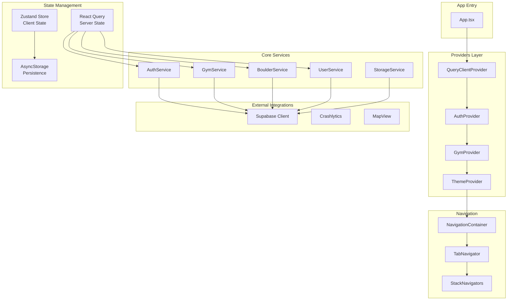

# Components (Logical Components)

Cette section définit les composants logiques (services, providers, hooks) qui orchestrent la logique métier de l'application.

## Component Diagram



## AuthProvider

**Purpose:** Gère l'état d'authentification global et expose le contexte utilisateur

```typescript
// src/providers/AuthProvider.tsx

import React, { createContext, useContext, useEffect, useState } from 'react';
import { Session, User } from '@supabase/supabase-js';
import { supabase } from '@/lib/supabase';

interface AuthContextType {
  session: Session | null;
  user: User | null;
  isLoading: boolean;
  isAuthenticated: boolean;
  signIn: (email: string, password: string) => Promise<void>;
  signUp: (email: string, password: string) => Promise<void>;
  signOut: () => Promise<void>;
}

const AuthContext = createContext<AuthContextType | undefined>(undefined);

export function AuthProvider({ children }: { children: React.ReactNode }) {
  const [session, setSession] = useState<Session | null>(null);
  const [isLoading, setIsLoading] = useState(true);

  useEffect(() => {
    // Get initial session
    supabase.auth.getSession().then(({ data: { session } }) => {
      setSession(session);
      setIsLoading(false);
    });

    // Listen for auth changes
    const { data: { subscription } } = supabase.auth.onAuthStateChange(
      (_event, session) => {
        setSession(session);
      }
    );

    return () => subscription.unsubscribe();
  }, []);

  const value: AuthContextType = {
    session,
    user: session?.user ?? null,
    isLoading,
    isAuthenticated: !!session,
    signIn: async (email, password) => {
      const { error } = await supabase.auth.signInWithPassword({ email, password });
      if (error) throw error;
    },
    signUp: async (email, password) => {
      const { error } = await supabase.auth.signUp({ email, password });
      if (error) throw error;
    },
    signOut: async () => {
      const { error } = await supabase.auth.signOut();
      if (error) throw error;
    },
  };

  return <AuthContext.Provider value={value}>{children}</AuthContext.Provider>;
}

export const useAuth = () => {
  const context = useContext(AuthContext);
  if (!context) throw new Error('useAuth must be used within AuthProvider');
  return context;
};
```

## GymStore (Zustand)

**Purpose:** Gère la salle sélectionnée avec persistence locale

```typescript
// src/stores/gymStore.ts

import { create } from 'zustand';
import { persist, createJSONStorage } from 'zustand/middleware';
import AsyncStorage from '@react-native-async-storage/async-storage';
import type { Gym } from '@/types/models';

interface GymState {
  selectedGym: Gym | null;
  setSelectedGym: (gym: Gym | null) => void;
  clearSelectedGym: () => void;
}

export const useGymStore = create<GymState>()(
  persist(
    (set) => ({
      selectedGym: null,
      setSelectedGym: (gym) => set({ selectedGym: gym }),
      clearSelectedGym: () => set({ selectedGym: null }),
    }),
    {
      name: 'gym-storage',
      storage: createJSONStorage(() => AsyncStorage),
    }
  )
);
```

## Custom Hooks

```typescript
// src/hooks/useGyms.ts
import { useQuery } from '@tanstack/react-query';
import { queryKeys } from '@/lib/queryClient';
import { getGyms, getGymWithWalls } from '@/services/api/gyms';

export function useGyms() {
  return useQuery({
    queryKey: queryKeys.gyms.all,
    queryFn: getGyms,
  });
}

export function useGymDetails(gymId: string) {
  return useQuery({
    queryKey: queryKeys.gyms.withWalls(gymId),
    queryFn: () => getGymWithWalls(gymId),
    enabled: !!gymId,
  });
}

// src/hooks/useBoulders.ts
import { useQuery, useMutation, useQueryClient } from '@tanstack/react-query';
import { queryKeys } from '@/lib/queryClient';
import { getWallBoulders, validateBoulder } from '@/services/api/boulders';
import { useAuth } from '@/providers/AuthProvider';

export function useWallBoulders(wallId: string) {
  const { user } = useAuth();

  return useQuery({
    queryKey: queryKeys.boulders.byWall(wallId),
    queryFn: () => getWallBoulders(wallId, user?.id),
    enabled: !!wallId,
  });
}

export function useValidateBoulder() {
  const queryClient = useQueryClient();
  const { user } = useAuth();

  return useMutation({
    mutationFn: (boulderId: string) => validateBoulder(boulderId, user!.id),
    onSuccess: () => {
      // Invalidate related queries
      queryClient.invalidateQueries({ queryKey: ['boulders'] });
      queryClient.invalidateQueries({ queryKey: queryKeys.user.validations(user!.id) });
      queryClient.invalidateQueries({ queryKey: queryKeys.user.profile(user!.id) });
    },
  });
}

// src/hooks/useLeaderboard.ts
import { useQuery } from '@tanstack/react-query';
import { queryKeys } from '@/lib/queryClient';
import { getLeaderboard } from '@/services/api/users';
import { useGymStore } from '@/stores/gymStore';

export function useLeaderboard() {
  const { selectedGym } = useGymStore();

  return useQuery({
    queryKey: queryKeys.leaderboard(selectedGym?.id),
    queryFn: () => getLeaderboard(selectedGym?.id),
    staleTime: 2 * 60 * 1000, // 2 minutes - classement plus dynamique
  });
}
```

## Service Layer

```typescript
// src/services/api/gyms.ts
import { supabase } from '@/lib/supabase';
import type { Gym, GymWithDetails } from '@/types/models';

export async function getGyms(): Promise<Gym[]> {
  const { data, error } = await supabase
    .from('gyms')
    .select('*')
    .order('name');

  if (error) throw error;
  return data;
}

export async function getGymWithWalls(gymId: string): Promise<GymWithDetails> {
  const { data, error } = await supabase
    .from('gyms')
    .select(`
      *,
      walls (*, boulders (count)),
      gym_photos (id, url, order_index)
    `)
    .eq('id', gymId)
    .single();

  if (error) throw error;
  return data;
}

// src/services/api/users.ts
import { supabase } from '@/lib/supabase';
import type { UserProfile } from '@/types/models';

export async function getLeaderboard(gymId?: string): Promise<UserProfile[]> {
  let query = supabase
    .from('users')
    .select('*')
    .order('total_points', { ascending: false })
    .limit(50);

  // TODO: Filter by gym in V2 (requires gym_id on validations)

  const { data, error } = await query;
  if (error) throw error;

  // Add rank
  return data.map((user, index) => ({
    ...user,
    rank: index + 1,
    validations_count: 0,
    favorites_count: 0,
  }));
}

export async function getUserProfile(userId: string): Promise<UserProfile> {
  const { data, error } = await supabase
    .from('users')
    .select(`
      *,
      validations (count),
      favorites (count)
    `)
    .eq('id', userId)
    .single();

  if (error) throw error;

  return {
    ...data,
    validations_count: data.validations?.[0]?.count ?? 0,
    favorites_count: data.favorites?.[0]?.count ?? 0,
    rank: null,
  };
}

export async function updateUserProfile(
  userId: string,
  updates: { username?: string; bio?: string; avatar_url?: string }
) {
  const { data, error } = await supabase
    .from('users')
    .update(updates)
    .eq('id', userId)
    .select()
    .single();

  if (error) throw error;
  return data;
}
```

## Supabase Client Configuration

```typescript
// src/lib/supabase.ts
import 'react-native-url-polyfill/auto';
import { createClient } from '@supabase/supabase-js';
import AsyncStorage from '@react-native-async-storage/async-storage';
import type { Database } from '@/types/database';

const supabaseUrl = process.env.EXPO_PUBLIC_SUPABASE_URL!;
const supabaseAnonKey = process.env.EXPO_PUBLIC_SUPABASE_ANON_KEY!;

export const supabase = createClient<Database>(supabaseUrl, supabaseAnonKey, {
  auth: {
    storage: AsyncStorage,
    autoRefreshToken: true,
    persistSession: true,
    detectSessionInUrl: false,
  },
});
```

---
