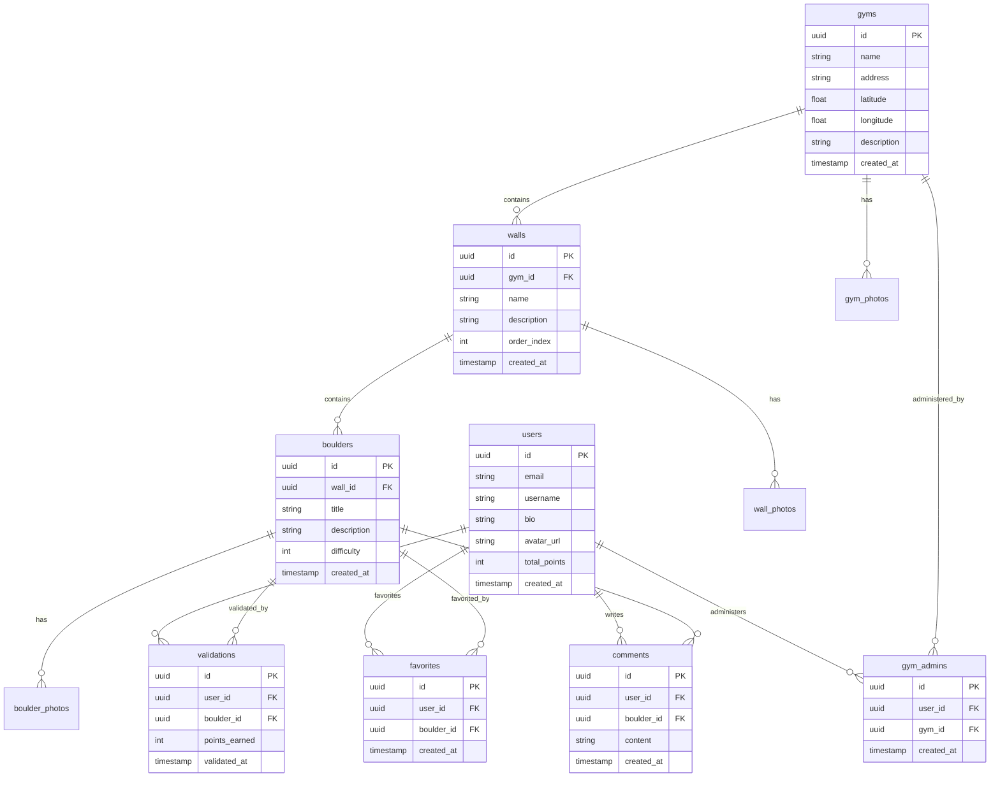

# Data Models

Cette section définit les entités métier partagées entre frontend et backend. Les 12 tables du PRD sont organisées en domaines fonctionnels.

## Entity Relationship Diagram



## User

**Purpose:** Représente un utilisateur de l'application (grimpeur ou admin)

**Key Attributes:**

- `id`: uuid - Identifiant unique (Supabase Auth)
- `email`: string - Email de connexion
- `username`: string | null - Pseudo affiché
- `bio`: string | null - Description profil
- `avatar_url`: string | null - URL de l'avatar dans Storage
- `total_points`: int - Score total calculé
- `created_at`: timestamp - Date d'inscription

### TypeScript Interface

```typescript
// src/types/models/user.ts
export interface User {
  id: string;
  email: string;
  username: string | null;
  bio: string | null;
  avatar_url: string | null;
  total_points: number;
  created_at: string;
}

export interface UserProfile extends User {
  validations_count: number;
  favorites_count: number;
  rank: number | null;
}
```

### Relationships

- Has many `validations` (boulders validés)
- Has many `favorites` (boulders favoris)
- Has many `comments`
- May be `gym_admin` of multiple gyms

---

## Gym

**Purpose:** Représente une salle d'escalade

**Key Attributes:**

- `id`: uuid - Identifiant unique
- `name`: string - Nom de la salle
- `address`: string - Adresse complète
- `latitude`: float - Coordonnée GPS
- `longitude`: float - Coordonnée GPS
- `description`: string | null - Description

### TypeScript Interface

```typescript
// src/types/models/gym.ts
export interface Gym {
  id: string;
  name: string;
  address: string;
  latitude: number;
  longitude: number;
  description: string | null;
  created_at: string;
}

export interface GymWithDetails extends Gym {
  walls_count: number;
  boulders_count: number;
  photos: GymPhoto[];
}
```

### Relationships

- Has many `walls`
- Has many `gym_photos`
- Has many `gym_admins`

---

## Wall

**Purpose:** Représente un mur dans une salle (secteur)

**Key Attributes:**

- `id`: uuid - Identifiant unique
- `gym_id`: uuid - Salle parente
- `name`: string - Nom du mur (ex: "Mur Nord")
- `description`: string | null
- `order_index`: int - Ordre d'affichage

### TypeScript Interface

```typescript
// src/types/models/wall.ts
export interface Wall {
  id: string;
  gym_id: string;
  name: string;
  description: string | null;
  order_index: number;
  created_at: string;
}

export interface WallWithBoulders extends Wall {
  boulders: Boulder[];
  photos: WallPhoto[];
}
```

### Relationships

- Belongs to `gym`
- Has many `boulders`
- Has many `wall_photos`

---

## Boulder

**Purpose:** Représente un bloc/problème d'escalade

**Key Attributes:**

- `id`: uuid - Identifiant unique
- `wall_id`: uuid - Mur parent
- `title`: string - Nom du boulder
- `description`: string | null - Instructions, beta
- `difficulty`: int (1-10) - Niveau de difficulté

### TypeScript Interface

```typescript
// src/types/models/boulder.ts
export interface Boulder {
  id: string;
  wall_id: string;
  title: string;
  description: string | null;
  difficulty: number; // 1-10
  created_at: string;
}

export interface BoulderWithDetails extends Boulder {
  photos: BoulderPhoto[];
  validations_count: number;
  comments_count: number;
  is_validated?: boolean; // Pour l'utilisateur courant
  is_favorited?: boolean; // Pour l'utilisateur courant
}
```

### Relationships

- Belongs to `wall`
- Has many `boulder_photos`
- Has many `validations`
- Has many `favorites`
- Has many `comments`

---

## Validation

**Purpose:** Enregistre quand un utilisateur valide un boulder

**Key Attributes:**

- `id`: uuid - Identifiant unique
- `user_id`: uuid - Utilisateur
- `boulder_id`: uuid - Boulder validé
- `points_earned`: int - Points gagnés (difficulté × 10)
- `validated_at`: timestamp

### TypeScript Interface

```typescript
// src/types/models/validation.ts
export interface Validation {
  id: string;
  user_id: string;
  boulder_id: string;
  points_earned: number;
  validated_at: string;
}

export interface ValidationWithBoulder extends Validation {
  boulder: Boulder;
}
```

### Business Rules

- Un utilisateur ne peut valider un boulder qu'une seule fois (UNIQUE constraint)
- `points_earned` = boulder.difficulty × 10
- Points conservés même si le boulder est supprimé (NFR8)

---

## Photo Tables (gym_photos, wall_photos, boulder_photos)

**Purpose:** Stocke les références aux images dans Supabase Storage

### TypeScript Interface

```typescript
// src/types/models/photo.ts
export interface Photo {
  id: string;
  url: string;
  order_index: number;
  created_at: string;
}

export interface GymPhoto extends Photo {
  gym_id: string;
}

export interface WallPhoto extends Photo {
  wall_id: string;
}

export interface BoulderPhoto extends Photo {
  boulder_id: string;
}
```

---
