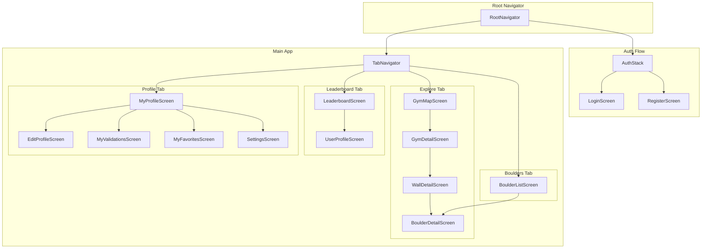

# Frontend Architecture

Cette section détaille l'architecture React Native, incluant la structure des composants, la navigation, et le state management.

## Navigation Structure



## Navigation Implementation

```typescript
// src/navigation/types.ts

export type RootStackParamList = {
  Auth: undefined;
  Main: undefined;
};

export type AuthStackParamList = {
  Login: undefined;
  Register: undefined;
};

export type MainTabParamList = {
  Explore: undefined;
  Boulders: undefined;
  Leaderboard: undefined;
  Profile: undefined;
};

export type ExploreStackParamList = {
  GymMap: undefined;
  GymDetail: { gymId: string };
  WallDetail: { wallId: string; wallName: string };
  BoulderDetail: { boulderId: string };
};

export type ProfileStackParamList = {
  MyProfile: undefined;
  EditProfile: undefined;
  MyValidations: undefined;
  MyFavorites: undefined;
  Settings: undefined;
};

// src/navigation/RootNavigator.tsx

import { createNativeStackNavigator } from '@react-navigation/native-stack';
import { useAuth } from '@/providers/AuthProvider';
import { AuthStack } from './AuthStack';
import { MainTabs } from './MainTabs';

const Stack = createNativeStackNavigator<RootStackParamList>();

export function RootNavigator() {
  const { isAuthenticated, isLoading } = useAuth();

  if (isLoading) {
    return <SplashScreen />;
  }

  return (
    <Stack.Navigator screenOptions={{ headerShown: false }}>
      {isAuthenticated ? (
        <Stack.Screen name="Main" component={MainTabs} />
      ) : (
        <Stack.Screen name="Auth" component={AuthStack} />
      )}
    </Stack.Navigator>
  );
}

// src/navigation/MainTabs.tsx

import { createBottomTabNavigator } from '@react-navigation/bottom-tabs';
import { MapPin, Mountains, Trophy, User } from 'phosphor-react-native';
import { colors } from '@/theme/colors';

const Tab = createBottomTabNavigator<MainTabParamList>();

export function MainTabs() {
  return (
    <Tab.Navigator
      screenOptions={{
        headerShown: false,
        tabBarActiveTintColor: colors.primary,
        tabBarInactiveTintColor: colors.textSecondary,
        tabBarStyle: {
          height: 64,
          paddingBottom: 8,
          paddingTop: 8,
        },
      }}
    >
      <Tab.Screen
        name="Explore"
        component={ExploreStack}
        options={{
          tabBarLabel: 'Explorer',
          tabBarIcon: ({ color, size }) => <MapPin size={size} color={color} />,
        }}
      />
      <Tab.Screen
        name="Boulders"
        component={BouldersStack}
        options={{
          tabBarLabel: 'Blocs',
          tabBarIcon: ({ color, size }) => <Mountains size={size} color={color} />,
        }}
      />
      <Tab.Screen
        name="Leaderboard"
        component={LeaderboardStack}
        options={{
          tabBarLabel: 'Classement',
          tabBarIcon: ({ color, size }) => <Trophy size={size} color={color} />,
        }}
      />
      <Tab.Screen
        name="Profile"
        component={ProfileStack}
        options={{
          tabBarLabel: 'Profil',
          tabBarIcon: ({ color, size }) => <User size={size} color={color} />,
        }}
      />
    </Tab.Navigator>
  );
}
```

## Component Architecture

```
src/
├── components/
│   ├── ui/                     # Design system primitives
│   │   ├── Button.tsx
│   │   ├── Text.tsx
│   │   ├── Input.tsx
│   │   ├── Card.tsx
│   │   ├── Badge.tsx
│   │   ├── Avatar.tsx
│   │   ├── IconButton.tsx
│   │   └── LoadingSpinner.tsx
│   │
│   ├── boulder/                # Boulder domain components
│   │   ├── BoulderCard.tsx
│   │   ├── BoulderGrid.tsx
│   │   ├── DifficultyBadge.tsx
│   │   ├── ValidationButton.tsx
│   │   ├── FavoriteButton.tsx
│   │   └── CommentList.tsx
│   │
│   ├── gym/                    # Gym domain components
│   │   ├── GymCard.tsx
│   │   ├── GymMarker.tsx
│   │   ├── WallCard.tsx
│   │   └── WallSection.tsx
│   │
│   ├── user/                   # User domain components
│   │   ├── UserAvatar.tsx
│   │   ├── UserStats.tsx
│   │   ├── LeaderboardRow.tsx
│   │   └── ProfileHeader.tsx
│   │
│   └── layout/                 # Layout components
│       ├── Screen.tsx
│       ├── Header.tsx
│       ├── EmptyState.tsx
│       └── ErrorBoundary.tsx
```

## Key UI Components

```typescript
// src/components/boulder/BoulderCard.tsx

import { Pressable, View, StyleSheet } from 'react-native';
import { Image } from 'expo-image';
import Animated, {
  useAnimatedStyle,
  useSharedValue,
  withSpring
} from 'react-native-reanimated';
import { DifficultyBadge } from './DifficultyBadge';
import { FavoriteButton } from './FavoriteButton';
import { ValidationIndicator } from './ValidationIndicator';
import { Text } from '@/components/ui/Text';
import { cardStyles } from '@/theme/components';
import { animations } from '@/theme/animations';
import type { BoulderWithDetails } from '@/types/models';

interface BoulderCardProps {
  boulder: BoulderWithDetails;
  onPress: () => void;
}

export function BoulderCard({ boulder, onPress }: BoulderCardProps) {
  const scale = useSharedValue(1);

  const animatedStyle = useAnimatedStyle(() => ({
    transform: [{ scale: scale.value }],
  }));

  const handlePressIn = () => {
    scale.value = withSpring(animations.scale.pressed, animations.spring.stiff);
  };

  const handlePressOut = () => {
    scale.value = withSpring(1, animations.spring.default);
  };

  const photoUrl = boulder.photos?.[0]?.url;

  return (
    <Animated.View style={animatedStyle}>
      <Pressable
        onPress={onPress}
        onPressIn={handlePressIn}
        onPressOut={handlePressOut}
        style={[cardStyles.base, cardStyles.boulder]}
      >
        {photoUrl ? (
          <Image
            source={{ uri: photoUrl }}
            style={StyleSheet.absoluteFill}
            contentFit="cover"
            transition={200}
          />
        ) : (
          <View style={styles.placeholder} />
        )}

        {/* Gradient overlay */}
        <View style={styles.gradient} />

        {/* Top badges */}
        <View style={styles.topRow}>
          <DifficultyBadge level={boulder.difficulty} />
          <FavoriteButton
            isFavorited={boulder.is_favorited}
            boulderId={boulder.id}
          />
        </View>

        {/* Bottom info */}
        <View style={styles.bottomRow}>
          <Text style={styles.title} numberOfLines={1}>
            {boulder.title}
          </Text>
          {boulder.is_validated && <ValidationIndicator />}
        </View>
      </Pressable>
    </Animated.View>
  );
}

// src/components/boulder/ValidationButton.tsx

import { Pressable } from 'react-native';
import Animated, {
  useAnimatedStyle,
  useSharedValue,
  withSequence,
  withSpring,
  withTiming,
} from 'react-native-reanimated';
import { CheckCircle } from 'phosphor-react-native';
import { useValidateBoulder } from '@/hooks/useBoulders';
import { colors } from '@/theme/colors';
import { haptics } from '@/lib/haptics';

interface ValidationButtonProps {
  boulderId: string;
  isValidated: boolean;
  difficulty: number;
}

export function ValidationButton({
  boulderId,
  isValidated,
  difficulty
}: ValidationButtonProps) {
  const { mutate: validate, isPending } = useValidateBoulder();
  const scale = useSharedValue(1);
  const opacity = useSharedValue(isValidated ? 1 : 0.6);

  const animatedStyle = useAnimatedStyle(() => ({
    transform: [{ scale: scale.value }],
    opacity: opacity.value,
  }));

  const handlePress = () => {
    if (isValidated || isPending) return;

    // Trigger haptic feedback
    haptics.success();

    // Animate
    scale.value = withSequence(
      withSpring(1.3, { damping: 8, stiffness: 200 }),
      withSpring(1, { damping: 10, stiffness: 150 })
    );
    opacity.value = withTiming(1, { duration: 300 });

    // Mutate
    validate(boulderId);
  };

  return (
    <Pressable onPress={handlePress} disabled={isValidated || isPending}>
      <Animated.View style={animatedStyle}>
        <CheckCircle
          size={56}
          weight={isValidated ? 'fill' : 'regular'}
          color={isValidated ? colors.success : colors.white}
        />
        <Text style={styles.points}>
          +{difficulty * 10} pts
        </Text>
      </Animated.View>
    </Pressable>
  );
}
```

## State Management Flow

```
┌─────────────────────────────────────────────────────────────┐
│                        UI Components                         │
│  BoulderCard, LeaderboardRow, ProfileHeader, etc.           │
└─────────────────────────┬───────────────────────────────────┘
                          │
                          ▼
┌─────────────────────────────────────────────────────────────┐
│                      Custom Hooks                            │
│  useGyms, useBoulders, useLeaderboard, useAuth              │
│  - Encapsulate data fetching logic                          │
│  - Provide loading/error states                             │
│  - Handle cache invalidation                                │
└────────────┬────────────────────────────┬───────────────────┘
             │                            │
             ▼                            ▼
┌────────────────────────┐    ┌───────────────────────────────┐
│    React Query         │    │      Zustand Stores           │
│    (Server State)      │    │      (Client State)           │
│                        │    │                               │
│  - Gyms, Walls data    │    │  - Selected Gym               │
│  - Boulders data       │    │  - UI preferences             │
│  - User profiles       │    │  - Local filters              │
│  - Leaderboard         │    │                               │
│                        │    │  Persisted via AsyncStorage   │
│  Cache: 5min stale     │    │                               │
└────────────┬───────────┘    └───────────────────────────────┘
             │
             ▼
┌─────────────────────────────────────────────────────────────┐
│                    Service Layer                             │
│  src/services/api/*.ts                                      │
│  - Abstract Supabase client                                 │
│  - Transform data to app models                             │
│  - Handle errors consistently                               │
└────────────┬────────────────────────────────────────────────┘
             │
             ▼
┌─────────────────────────────────────────────────────────────┐
│                    Supabase Client                           │
│  - PostgREST queries                                        │
│  - Auth operations                                          │
│  - Storage uploads                                          │
└─────────────────────────────────────────────────────────────┘
```

## Form Handling with Zod

```typescript
// src/lib/schemas/user.ts

import { z } from 'zod';

export const editProfileSchema = z.object({
  username: z
    .string()
    .min(3, 'Minimum 3 caractères')
    .max(20, 'Maximum 20 caractères')
    .regex(/^[a-zA-Z0-9_]+$/, 'Lettres, chiffres et _ uniquement')
    .optional()
    .or(z.literal('')),
  bio: z
    .string()
    .max(200, 'Maximum 200 caractères')
    .optional()
    .or(z.literal('')),
});

export type EditProfileFormData = z.infer<typeof editProfileSchema>;

// src/screens/profile/EditProfileScreen.tsx

import { useState } from 'react';
import { editProfileSchema, EditProfileFormData } from '@/lib/schemas/user';

export function EditProfileScreen() {
  const [formData, setFormData] = useState<EditProfileFormData>({
    username: '',
    bio: '',
  });
  const [errors, setErrors] = useState<Record<string, string>>({});

  const handleSubmit = () => {
    const result = editProfileSchema.safeParse(formData);

    if (!result.success) {
      const fieldErrors: Record<string, string> = {};
      result.error.issues.forEach((issue) => {
        const field = issue.path[0] as string;
        fieldErrors[field] = issue.message;
      });
      setErrors(fieldErrors);
      return;
    }

    // Submit valid data
    updateProfile(result.data);
  };

  // ...render form with error display
}
```

---
