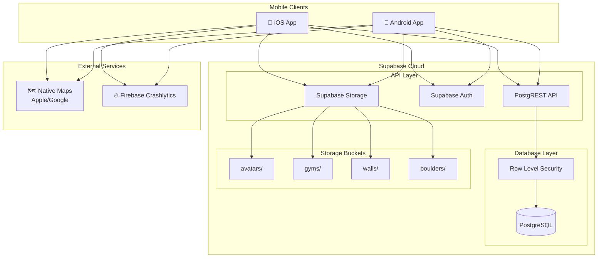

# High Level Architecture

## Technical Summary

Cette application mobile d'escalade utilise une architecture **BaaS (Backend-as-a-Service)** avec Supabase comme backend tout-en-un, éliminant le besoin d'un serveur custom. Le frontend React Native avec Expo communique directement avec les APIs auto-générées de Supabase (REST/PostgREST). La sécurité est assurée par Row Level Security (RLS) au niveau PostgreSQL, permettant une logique d'autorisation déclarative par rôle (Invité, Utilisateur, Admin). Cette architecture serverless garantit un coût nul pour le MVP (free tier) tout en offrant une scalabilité native pour V2.

## Platform and Infrastructure Choice

**Platform:** Supabase Cloud (Free Tier)

**Rationale:** Le PRD impose explicitement Supabase pour respecter la contrainte NFR4 (coûts dans le free tier). C'est le choix optimal pour ce MVP car :

- Zéro coût initial (500MB database, 1GB storage, 50K monthly active users)
- Auth, DB, Storage, Realtime intégrés
- API REST auto-générée depuis le schéma PostgreSQL
- RLS natif pour la sécurité multi-tenant

**Key Services:**

| Service             | Usage                                      | Free Tier Limit     |
| ------------------- | ------------------------------------------ | ------------------- |
| PostgreSQL Database | 12 tables métier                           | 500 MB              |
| Supabase Auth       | Email/password                             | 50K MAU             |
| Supabase Storage    | 4 buckets (avatars, gyms, walls, boulders) | 1 GB                |
| PostgREST API       | REST auto-généré                           | Unlimited requests  |
| Edge Functions      | Triggers/webhooks (si nécessaire)          | 500K invocations    |

**Deployment Regions:** eu-west-1 (Paris) - Proximité utilisateurs français

## Repository Structure

**Structure:** Monorepo simple (single app)

**Rationale:** Le PRD spécifie un monorepo car il n'y a qu'une seule application React Native sans backend custom. La logique métier est dans Supabase (RLS + triggers).

**Package Organization:**

- `/` - Racine du projet Expo
- `/src` - Code source React Native
- `/supabase` - Migrations SQL, seed data, types générés

## High Level Architecture Diagram

## Architectural Patterns

- **BaaS Architecture:** Supabase gère l'intégralité du backend (DB, Auth, Storage, API) - _Rationale:_ Élimine la maintenance serveur, coût nul pour MVP, scalabilité automatique

- **Repository Pattern (Client-Side):** Abstraction des appels Supabase dans des services dédiés - _Rationale:_ Découplage entre UI et data layer, facilite les tests et migrations futures

- **Row Level Security (RLS):** Politiques d'accès déclaratives au niveau PostgreSQL - _Rationale:_ Sécurité "defense in depth", impossible de contourner même avec accès direct à l'API

- **Optimistic Updates:** Mise à jour immédiate de l'UI avant confirmation serveur - _Rationale:_ UX fluide pour les actions fréquentes (validation boulder, favoris)

- **Offline-First Ready:** Architecture préparée pour le mode offline (V2) - _Rationale:_ AsyncStorage pour persistence locale, React Query pour cache intelligent

- **Component-Based UI:** Composants React Native réutilisables avec TypeScript - _Rationale:_ Maintenabilité, cohérence UI, design system du Front-End Spec

---
