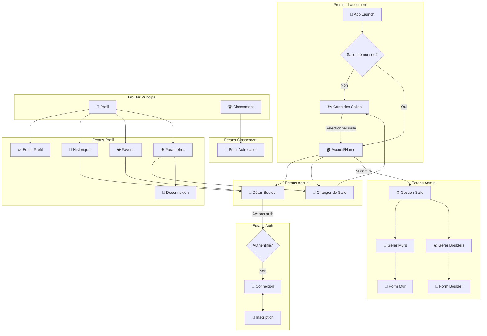
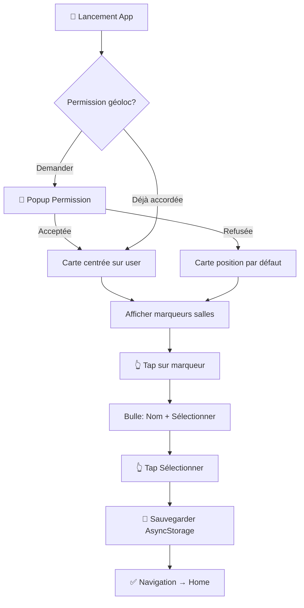
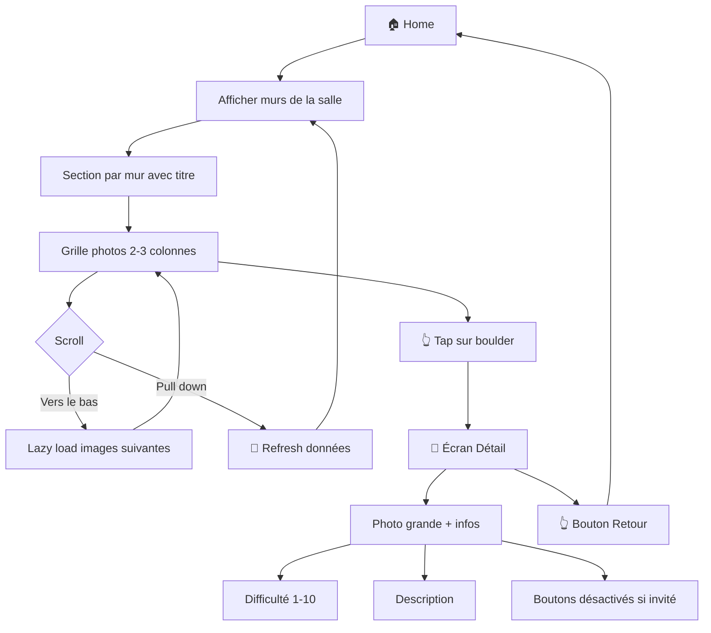
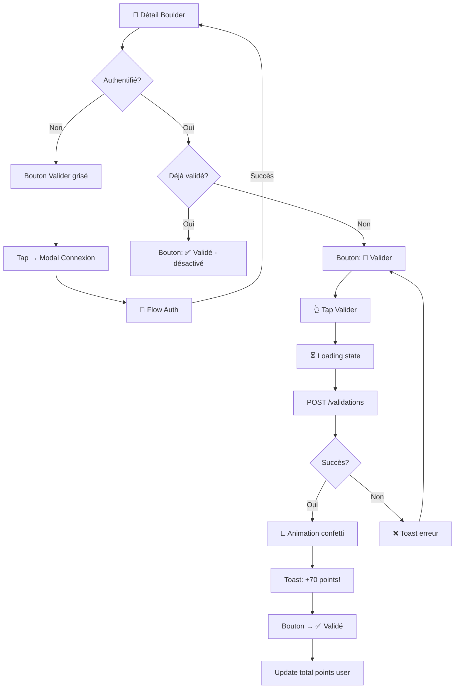
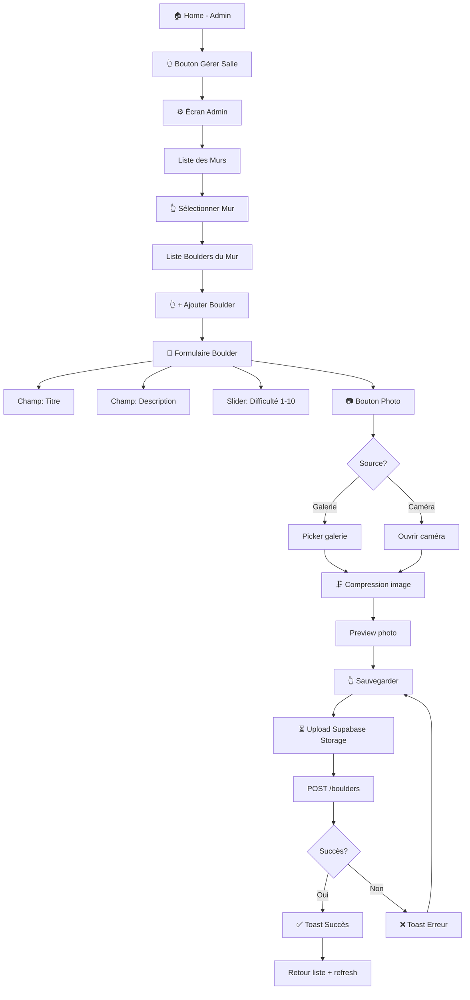

# Application Mobile d'Escalade - UI/UX Specification

This document defines the user experience goals, information architecture, user flows, and visual design specifications for **Application Mobile d'Escalade**'s user interface. It serves as the foundation for visual design and frontend development, ensuring a cohesive and user-centered experience.

## Overall UX Goals & Principles

### Target User Personas

| Persona | Description |
|---------|-------------|
| **🧗 Grimpeur Invité** | Utilisateur curieux qui découvre l'app sans créer de compte. Veut explorer les salles et boulders en lecture seule. Besoin : accès rapide, zéro friction. |
| **🏆 Grimpeur Authentifié** | Grimpeur régulier qui veut tracker sa progression, valider ses ascensions et se comparer aux autres. Besoin : gamification, stats personnelles, classements. |
| **⚙️ Admin de Salle** | Gérant ou employé d'une salle qui maintient le contenu (murs, boulders, photos). Besoin : outils CRUD simples, upload photo rapide. |

### Usability Goals

- **Découverte en < 30 secondes** : Un nouvel utilisateur peut voir les boulders d'une salle sans inscription
- **Validation en 1 tap** : Valider un boulder = un seul bouton, pas de formulaire
- **Navigation intuitive** : 3 onglets maximum, parcours prévisible
- **Performance fluide** : Lazy loading des images, pas de loading spinners prolongés
- **Offline-tolerant** : Affichage gracieux en cas de connexion lente (V2 pour mode offline complet)

### Design Principles

1. **📸 Visual-First** - Les photos des boulders sont le contenu principal, l'UI s'efface pour les mettre en valeur
2. **⚡ Action Immédiate** - Chaque interaction donne un feedback instantané (validation, favori, commentaire)
3. **🎯 Progressive Disclosure** - Invités voient le contenu, authentifiés débloquent les actions
4. **🏔️ Simplicité Alpine** - Interface épurée inspirée de l'escalade : pas de surcharge, focus sur l'essentiel
5. **♿ Accessible par Défaut** - Touch targets 44x44px, contrastes WCAG AA, labels screen-reader

### Change Log

| Date | Version | Description | Author |
|------|---------|-------------|--------|
| 2026-01-06 | 0.1 | Draft initial | Sally (UX Expert) |

---

## Information Architecture (IA)

### Site Map / Screen Inventory



### Navigation Structure

**Primary Navigation (Tab Bar):**

| Onglet | Icône | Écran | Accessible à |
|--------|-------|-------|--------------|
| Accueil | 🏠 `home` | Grille boulders par murs | Tous |
| Profil | 👤 `user` | Stats & paramètres | Tous (contenu adapté) |
| Classement | 🏆 `trophy` | Leaderboards | Tous |

**Secondary Navigation:**
- **Header Home** : Nom de la salle + tap pour changer → Modal ou retour carte
- **Stack Navigation** : Détail boulder, profils autres users, formulaires admin
- **Bottom Sheet** : Actions rapides (valider, favori, commenter)

**Breadcrumb Strategy:**
- Pas de breadcrumbs traditionnels (mobile-first)
- Bouton retour natif iOS/Android
- Titre de l'écran dans le header indique le contexte

---

## User Flows

### Flow 1: Découverte & Sélection de Salle

**User Goal:** Trouver et sélectionner une salle d'escalade proche pour commencer à explorer

**Entry Points:**
- Premier lancement de l'app
- Tap sur "Changer de salle" depuis Header ou Settings

**Success Criteria:**
- Utilisateur a sélectionné une salle
- Salle mémorisée pour les prochains lancements
- Navigation vers Home avec la salle active

#### Flow Diagram



#### Edge Cases & Error Handling
- Pas de connexion internet → Message "Vérifiez votre connexion" + bouton Retry
- Aucune salle dans la zone → Message "Aucune salle trouvée" + zoom out automatique
- Géolocalisation échoue → Position par défaut (centre-ville) avec message explicatif
- GPS imprécis → Rayon de recherche élargi

---

### Flow 2: Explorer les Boulders

**User Goal:** Parcourir visuellement les boulders d'une salle et voir les détails

**Entry Points:**
- Arrivée sur Home après sélection de salle
- Retour depuis Détail Boulder

**Success Criteria:**
- Utilisateur peut voir tous les murs et boulders
- Navigation fluide entre grille et détail
- Images chargées sans blocage

#### Flow Diagram



#### Edge Cases & Error Handling
- Mur sans boulders → Message "Aucun boulder pour le moment"
- Image ne charge pas → Placeholder avec icône broken image + retry on tap
- Connexion lente → Skeleton loaders pour les images
- Salle supprimée entre-temps → Message + redirection vers carte

---

### Flow 3: Valider un Boulder

**User Goal:** Marquer un boulder comme réussi et gagner des points

**Entry Points:**
- Écran Détail Boulder (authentifié uniquement)

**Success Criteria:**
- Validation enregistrée en BDD
- Points calculés et affichés
- Feedback visuel de succès
- Boulder marqué comme "déjà validé"

#### Flow Diagram



#### Edge Cases & Error Handling
- Double tap rapide → Désactiver bouton pendant request
- Erreur réseau → Toast "Erreur, réessayez" + bouton reste actif
- Boulder supprimé pendant validation → Message "Ce boulder n'existe plus"
- Session expirée → Redirect vers login, puis retour au boulder

---

### Flow 4: Gestion Admin (CRUD Boulder)

**User Goal:** Ajouter ou modifier un boulder dans sa salle

**Entry Points:**
- Bouton "Gérer" visible sur Home si admin de la salle active

**Success Criteria:**
- Boulder créé/modifié avec photo
- Visible immédiatement dans la grille
- Photo compressée avant upload

#### Flow Diagram



#### Edge Cases & Error Handling
- Photo trop grande après compression → Warning + option réduire qualité
- Upload interrompu → Retry automatique 3x, puis message erreur
- Champs obligatoires manquants → Validation inline avec messages
- Perte de connexion pendant saisie → Sauvegarder draft localement
- Suppression avec validations existantes → Confirmation "Les points restent acquis"

---

## Wireframes & Mockups

**Design Approach:** Implémentation directe par le développeur - Pas de phase Figma. Ce document sert de référence complète pour le design.

### Key Screen Layouts

#### 1. Carte des Salles (Gym Map)

**Purpose:** Permettre la découverte et sélection d'une salle d'escalade

**Key Elements:**
- Carte plein écran (Apple Maps iOS / Google Maps Android)
- Marqueurs personnalisés pour chaque salle (icône escalade)
- Bulle/Callout au tap avec nom de salle + bouton "Sélectionner"
- Bouton "Ma position" (bottom-right) pour recentrer
- Barre de recherche (top) pour filtrer par nom de salle

**Interaction Notes:**
- Carte interactive avec zoom/pan gestures
- Tap marqueur → affiche callout
- Tap callout "Sélectionner" → sauvegarde + navigation Home

```
┌─────────────────────────────┐
│ 🔍 Rechercher une salle...  │
├─────────────────────────────┤
│                             │
│      🗺️ CARTE              │
│                             │
│    📍        📍             │
│         📍                  │
│    ┌──────────────┐         │
│    │ Block'Out    │         │
│    │ [Sélectionner]│        │
│    └──────────────┘         │
│              📍             │
│                       [📍]  │
│                             │
└─────────────────────────────┘
```

---

#### 2. Home (Grille Boulders)

**Purpose:** Explorer les boulders d'une salle, organisés par murs

**Key Elements:**
- Header sticky : Nom de la salle (tappable) + icône dropdown
- Sections par mur avec titre collant (sticky section headers)
- Grille photo 2 colonnes (3 sur tablette)
- Badge difficulté sur chaque vignette (coin)
- Pull-to-refresh indicator
- FAB "Gérer" si admin (bottom-right)

**Interaction Notes:**
- Scroll vertical avec sections qui "collent" en haut
- Tap header → modal changement de salle
- Tap vignette → navigation détail boulder
- Long press vignette → preview rapide (optionnel V2)

```
┌─────────────────────────────┐
│ 🏠 Block'Out Paris    ▼     │
├─────────────────────────────┤
│ ══ Mur Nord ════════════════│
│ ┌─────────┐ ┌─────────┐     │
│ │ 📸      │ │ 📸      │     │
│ │    [7]  │ │    [4]  │     │
│ └─────────┘ └─────────┘     │
│ ┌─────────┐ ┌─────────┐     │
│ │ 📸      │ │ 📸      │     │
│ │    [9]  │ │    [5]  │     │
│ └─────────┘ └─────────┘     │
│ ══ Mur Sud ═════════════════│
│ ┌─────────┐ ┌─────────┐     │
│ │ 📸      │ │ 📸      │     │
│                       [⚙️]  │
├─────────────────────────────┤
│  🏠      👤      🏆         │
│ Home   Profil  Classement   │
└─────────────────────────────┘
```

---

#### 3. Détail Boulder

**Purpose:** Voir les infos complètes d'un boulder et effectuer des actions

**Key Elements:**
- Photo plein écran (scrollable/zoomable)
- Overlay gradient en bas pour lisibilité texte
- Titre + Difficulté (badge coloré selon niveau)
- Description (collapsible si longue)
- Barre d'actions : Valider | Favori | Commenter
- Section commentaires (scrollable)
- Bouton retour (top-left)

**Interaction Notes:**
- Swipe down ou bouton → retour grille
- Double-tap photo → zoom
- Boutons désactivés visuellement si invité
- Animation confetti après validation réussie

```
┌─────────────────────────────┐
│ ←                           │
│                             │
│                             │
│      📸 PHOTO BOULDER       │
│         (zoomable)          │
│                             │
│                             │
│ ▓▓▓▓▓▓▓▓▓▓▓▓▓▓▓▓▓▓▓▓▓▓▓▓▓▓▓│
│ La Dalle Infernale    [7]   │
│ Départ assis, main gauche...│
├─────────────────────────────┤
│  [🎯 Valider]  [❤️]  [💬 12]│
├─────────────────────────────┤
│ 💬 Commentaires             │
│ ┌─────────────────────────┐ │
│ │ 👤 Marie: Super bloc!   │ │
│ │ 👤 Tom: Attention au... │ │
│ └─────────────────────────┘ │
│ [Écrire un commentaire...]  │
└─────────────────────────────┘
```

---

#### 4. Profil Utilisateur

**Purpose:** Voir ses stats, historique et gérer son compte

**Key Elements:**
- Header avec avatar (éditable) + pseudo + bio
- 4 stats cards : Points | Validés | Favoris | Rang
- Tab bar : Historique | Favoris
- Liste scrollable selon l'onglet actif
- Bouton settings (top-right) → paramètres

**Interaction Notes:**
- Tap avatar → changer photo (galerie/caméra)
- Tap stat → pourrait naviguer vers détail (V2)
- Tap item historique/favori → détail boulder
- Pull-to-refresh pour actualiser stats

```
┌─────────────────────────────┐
│                        ⚙️   │
│         ┌─────┐             │
│         │ 👤  │             │
│         └─────┘             │
│       ClimbMaster42         │
│    "Grimpe et souris!"      │
├─────────────────────────────┤
│ ┌─────┐┌─────┐┌─────┐┌─────┐│
│ │1250 ││ 23  ││ 8   ││ #42 ││
│ │ pts ││valid││fav  ││rang ││
│ └─────┘└─────┘└─────┘└─────┘│
├─────────────────────────────┤
│ [Historique]  [Favoris]     │
├─────────────────────────────┤
│ 📸 La Dalle Infernale  +70  │
│ 📸 Le Surplomb         +50  │
│ 📸 Facile Dimanche     +20  │
│                             │
├─────────────────────────────┤
│  🏠      👤      🏆         │
└─────────────────────────────┘
```

---

#### 5. Classement (Leaderboard)

**Purpose:** Comparer sa progression avec les autres grimpeurs

**Key Elements:**
- Toggle : Global | Ma Salle
- Podium visuel pour Top 3 (optionnel, V2)
- Liste scrollable avec rang, avatar, pseudo, points
- Highlight de l'utilisateur connecté
- Tap sur une ligne → profil de l'autre user

**Interaction Notes:**
- Pull-to-refresh
- Scroll infini si beaucoup d'utilisateurs
- Toggle change les données affichées

```
┌─────────────────────────────┐
│        🏆 Classement        │
├─────────────────────────────┤
│  [Global]  [Block'Out]      │
├─────────────────────────────┤
│ #1  👤 ProClimber    3420   │
│ #2  👤 BoulderQueen  2890   │
│ #3  👤 GripMaster    2450   │
│ ─────────────────────────── │
│ #41 👤 JohnDoe       1280   │
│ #42 👤 ClimbMaster42 1250 ← │
│ #43 👤 NewbieRock    1180   │
│                             │
│                             │
├─────────────────────────────┤
│  🏠      👤      🏆         │
└─────────────────────────────┘
```

---

#### 6. Formulaire Boulder (Admin)

**Purpose:** Créer ou éditer un boulder

**Key Elements:**
- Header avec titre "Nouveau Boulder" / "Modifier Boulder"
- Champ titre (required)
- Champ description (textarea)
- Slider difficulté 1-10 avec preview visuel
- Zone photo avec preview + boutons Galerie/Caméra
- Boutons : Annuler | Sauvegarder
- Validation inline des champs

**Interaction Notes:**
- Slider avec haptic feedback à chaque step
- Photo preview avec option supprimer/remplacer
- Keyboard avoiding pour les champs texte
- Confirmation si on quitte avec modifications non sauvées

```
┌─────────────────────────────┐
│ ←  Nouveau Boulder   [Save] │
├─────────────────────────────┤
│ Titre *                     │
│ ┌─────────────────────────┐ │
│ │                         │ │
│ └─────────────────────────┘ │
│                             │
│ Description                 │
│ ┌─────────────────────────┐ │
│ │                         │ │
│ │                         │ │
│ └─────────────────────────┘ │
│                             │
│ Difficulté: 7               │
│ ○───────●───────○  [7]      │
│ Facile      Difficile       │
│                             │
│ Photo *                     │
│ ┌─────────────────────────┐ │
│ │      📸 Preview         │ │
│ │    [📷] [🖼️] [🗑️]      │ │
│ └─────────────────────────┘ │
│                             │
│ [Annuler]      [Sauvegarder]│
└─────────────────────────────┘
```

---

## Component Library / Design System

### Design System Approach

**Approche : Design System léger custom + React Native Paper**

Utiliser React Native Paper comme base avec une couche de theming personnalisée pour l'identité "escalade". Avantages :
- Démarrage rapide avec composants accessibles et testés
- Cohérence native iOS/Android out-of-the-box
- Personnalisation facile via le système de thèmes

### Core Components

#### Button

**Purpose:** Action principale ou secondaire

**Variants:**
- `primary` : Action principale (Valider, Sauvegarder)
- `secondary` : Action secondaire (Annuler, Retour)
- `ghost` : Action tertiaire, liens
- `icon-only` : Bouton icône (Favori, Fermer)
- `fab` : Floating Action Button (Admin)

**States:** `default` | `hover/pressed` | `disabled` | `loading`

**Usage Guidelines:**
- Un seul bouton primary par écran
- Minimum 44x44px pour accessibilité
- Loading state avec spinner, pas de texte changé

---

#### Card (Boulder Card)

**Purpose:** Afficher un boulder dans la grille

**Variants:**
- `grid` : Vignette carrée pour la grille (photo + badge difficulté)
- `list` : Version horizontale pour historique/favoris (photo + titre + points)

**States:** `default` | `loading` (skeleton) | `error` (image cassée)

**Usage Guidelines:**
- Ratio 1:1 pour la grille
- Badge difficulté toujours visible (coin inférieur droit)
- Border-radius cohérent (8px)

---

#### Badge (Difficulty Badge)

**Purpose:** Afficher la difficulté d'un boulder (1-10)

**Variants (couleur selon niveau):**
- `1-3` : Vert (Facile)
- `4-6` : Jaune/Orange (Moyen)
- `7-8` : Rouge (Difficile)
- `9-10` : Violet/Noir (Expert)

**Usage Guidelines:**
- Taille fixe, lisible même en petit (min 24x24px)
- Contraste suffisant avec le fond photo

---

#### Input

**Purpose:** Saisie de texte

**Variants:**
- `text` : Input texte simple
- `textarea` : Multi-ligne (description)
- `password` : Avec toggle visibilité
- `search` : Avec icône loupe et clear

**States:** `default` | `focused` | `error` | `disabled`

**Usage Guidelines:**
- Label au-dessus ou placeholder
- Message d'erreur sous le champ (rouge)
- Clear button pour search

---

#### Avatar

**Purpose:** Photo de profil utilisateur

**Variants:**
- `small` (32px) : Dans les listes, commentaires
- `medium` (48px) : Leaderboard
- `large` (80px) : Profil personnel

**States:** `default` | `loading` | `placeholder` (initiales ou icône)

**Usage Guidelines:**
- Toujours rond (border-radius: 50%)
- Placeholder avec initiales si pas de photo

---

#### Toast / Snackbar

**Purpose:** Feedback temporaire après une action

**Variants:**
- `success` : Vert (Validation réussie, +70 points!)
- `error` : Rouge (Erreur, réessayez)
- `info` : Bleu (Information neutre)

**Usage Guidelines:**
- Position bas de l'écran, au-dessus de la Tab Bar
- Auto-dismiss après 3 secondes
- Swipe to dismiss optionnel

---

#### Section Header

**Purpose:** Titre de section dans les listes (nom du mur)

**Variants:**
- `sticky` : Reste collé en haut pendant le scroll
- `default` : Scroll avec le contenu

**Usage Guidelines:**
- Fond légèrement différent pour distinction
- Typographie bold

---

#### Empty State

**Purpose:** Écran ou section vide

**Variants:**
- `no-data` : Aucune donnée (Aucun boulder)
- `error` : Erreur de chargement
- `no-results` : Recherche sans résultat

**Usage Guidelines:**
- Illustration simple et contextuelle
- Message clair et actionnable si possible
- CTA pour résoudre (Réessayer, Créer le premier...)

---

## Branding & Style Guide

### Visual Identity

**Brand Guidelines:** À créer - Proposition ci-dessous basée sur l'univers de l'escalade

### Color Palette

| Color Type | Hex Code | Usage |
|------------|----------|-------|
| **Primary** | `#FF6B35` | Actions principales, bouton Valider, accents énergiques |
| **Secondary** | `#2D3047` | Headers, texte principal, navigation |
| **Accent** | `#1B998B` | Liens, éléments interactifs secondaires |
| **Success** | `#06D6A0` | Validations réussies, badge Facile (1-3) |
| **Warning** | `#FFD166` | Alertes, badge Moyen (4-6) |
| **Error** | `#EF476F` | Erreurs, badge Difficile (7-8) |
| **Expert** | `#7B2CBF` | Badge Expert (9-10) |
| **Neutral-100** | `#FFFFFF` | Fonds clairs |
| **Neutral-200** | `#F8F9FA` | Fonds de sections |
| **Neutral-300** | `#E9ECEF` | Bordures, séparateurs |
| **Neutral-600** | `#6C757D` | Texte secondaire |
| **Neutral-900** | `#212529` | Texte principal |

### Typography

#### Font Families

- **Primary (Headings):** `Inter` - Moderne, géométrique, excellente lisibilité mobile
- **Secondary (Body):** `Inter` - Même famille pour cohérence
- **Monospace:** `JetBrains Mono` - Pour les stats/chiffres (points, rangs)

#### Type Scale

| Element | Size | Weight | Line Height |
|---------|------|--------|-------------|
| H1 | 32px | Bold (700) | 1.2 |
| H2 | 24px | SemiBold (600) | 1.3 |
| H3 | 20px | SemiBold (600) | 1.3 |
| Body | 16px | Regular (400) | 1.5 |
| Body Small | 14px | Regular (400) | 1.5 |
| Caption | 12px | Regular (400) | 1.4 |
| Button | 16px | SemiBold (600) | 1.0 |
| Stats | 24px | Bold (700) | 1.0 |

### Iconography

**Icon Library:** `Phosphor Icons` (React Native compatible)

**Usage Guidelines:**
- Style : Outline pour navigation, Filled pour actions actives
- Taille : 24px standard, 20px compact, 32px pour Tab Bar
- Couleur : Hérite du texte parent ou couleur sémantique

**Icônes clés :**

| Usage | Icône |
|-------|-------|
| Home | `house` |
| Profile | `user` |
| Leaderboard | `trophy` |
| Validate | `check-circle` |
| Favorite | `heart` |
| Comment | `chat-circle` |
| Settings | `gear` |
| Back | `arrow-left` |
| Location | `map-pin` |
| Camera | `camera` |
| Gallery | `image` |

### Spacing & Layout

**Grid System:**
- Base unit : `4px`
- Colonnes : 2 pour grille boulders mobile, 3 pour tablette
- Gouttières : `16px`
- Marges écran : `16px` horizontal

**Spacing Scale:**

| Token | Value | Usage |
|-------|-------|-------|
| `xs` | 4px | Padding interne compact |
| `sm` | 8px | Entre éléments liés |
| `md` | 16px | Padding standard, marges |
| `lg` | 24px | Entre sections |
| `xl` | 32px | Séparations majeures |
| `2xl` | 48px | Haut/bas d'écran |

**Border Radius:**

| Token | Value | Usage |
|-------|-------|-------|
| `sm` | 4px | Badges, petits éléments |
| `md` | 8px | Cards, inputs, boutons |
| `lg` | 16px | Modals, bottom sheets |
| `full` | 50% | Avatars |

---

## Accessibility Requirements

### Compliance Target

**Standard:** WCAG 2.1 Level AA

### Key Requirements

#### Visual

**Color Contrast Ratios:**
- Texte normal (< 18px) : minimum 4.5:1
- Texte large (≥ 18px bold ou ≥ 24px) : minimum 3:1
- Éléments UI (icônes, bordures) : minimum 3:1
- Badges de difficulté : fond opaque ou ombre pour lisibilité sur photos

**Focus Indicators:**
- Outline visible de 2px minimum pour éléments focusables
- Couleur d'outline contrastée avec le fond
- Pas de suppression de l'outline par défaut

**Text Sizing:**
- Taille de base : 16px minimum
- Support du zoom système jusqu'à 200%
- Pas de texte en image (sauf logo)

#### Interaction

**Keyboard Navigation:**
- Ordre de focus logique (top-to-bottom, left-to-right)
- Tous les éléments interactifs atteignables au clavier
- Gestures alternatives disponibles (swipe = bouton)

**Screen Reader Support:**
- Labels accessibles sur tous les boutons et inputs
- Images avec `accessibilityLabel` descriptif
- Annonces dynamiques pour changements d'état
- Rôles ARIA via React Native Accessibility props

**Touch Targets:**
- Minimum 44x44px pour tous les éléments interactifs
- Espacement minimum 8px entre les targets
- Zone de tap élargie si élément visuel plus petit

#### Content

**Alternative Text:**
- Photos de boulders : alt avec nom + difficulté
- Icônes décoratives masquées aux lecteurs d'écran
- Icônes fonctionnelles avec label accessible

**Heading Structure:**
- Hiérarchie logique (H1 > H2 > H3)
- Un seul H1 par écran
- Titres de sections en H2

**Form Labels:**
- Chaque input a un label associé
- Messages d'erreur liés au champ concerné
- Instructions claires pour champs avec contraintes

### Testing Strategy

**Outils de test :**
- **VoiceOver** (iOS) : Test manuel des parcours
- **TalkBack** (Android) : Test manuel des parcours
- **Accessibility Inspector** (Xcode) : Vérification labels/rôles
- **react-native-testing-library** : Tests automatisés

**Checklist par écran :**
- [ ] Navigation au clavier/switch possible
- [ ] Annonces correctes par VoiceOver/TalkBack
- [ ] Contrastes validés
- [ ] Touch targets ≥ 44px
- [ ] Zoom 200% sans perte de fonctionnalité

---

## Responsiveness Strategy

### Breakpoints

| Breakpoint | Min Width | Max Width | Target Devices |
|------------|-----------|-----------|----------------|
| **Mobile S** | 320px | 374px | iPhone SE, petits Android |
| **Mobile M** | 375px | 413px | iPhone 12/13/14, Pixel |
| **Mobile L** | 414px | 767px | iPhone Plus/Max, grands Android |
| **Tablet** | 768px | - | iPad, tablettes Android (V2) |

**Note MVP :** Focus sur Mobile S → Mobile L. Support tablette reporté en V2.

### Adaptation Patterns

**Layout Changes:**
- Grille boulders : 2 colonnes sur tous les mobiles, 3 colonnes sur tablette (V2)
- Stats cards (Profil) : 4 cards en ligne, taille adaptative
- Commentaires : Largeur pleine, padding adaptatif

**Navigation Changes:**
- Tab Bar : Taille fixe, icônes 32px
- Header : Hauteur fixe, texte tronqué avec ellipsis si trop long
- Bouton retour : Position fixe top-left

**Content Priority:**
- Photos = contenu prioritaire
- Sur petits écrans : descriptions tronquées avec "Voir plus"
- Stats numériques toujours visibles en entier

**Interaction Changes:**
- Touch targets identiques sur tous les écrans (44px min)
- Pull-to-refresh sur toutes les listes
- Gestures natives iOS/Android respectées

### Safe Areas

**iOS :**
- Respect du notch (safe area top)
- Respect de l'indicateur Home (safe area bottom)
- Tab Bar positionnée au-dessus de l'indicateur

**Android :**
- Respect de la status bar
- Respect de la navigation bar système
- Support des écrans avec encoche

**Implementation :** Utiliser `react-native-safe-area-context`

---

## Animation & Micro-interactions

### Motion Principles

1. **Purposeful** - Chaque animation a une raison fonctionnelle (feedback, guidage, transition)
2. **Quick** - Durées courtes (150-300ms) pour ne pas ralentir l'utilisateur
3. **Natural** - Courbes d'easing naturelles (ease-out pour apparitions, ease-in-out pour transitions)
4. **Consistent** - Mêmes timings et easings dans toute l'app
5. **Accessible** - Respecter `prefers-reduced-motion` pour les utilisateurs sensibles

### Key Animations

| Animation | Description | Duration | Easing |
|-----------|-------------|----------|--------|
| **Validation Success** | Confetti burst + scale bounce du bouton | 800ms | spring |
| **Points Toast** | Slide-up + fade-in depuis le bas | 300ms | ease-out |
| **Tab Switch** | Crossfade entre écrans | 200ms | ease-in-out |
| **Boulder Card Press** | Scale down à 0.95 au press | 100ms | ease-out |
| **Image Lazy Load** | Fade-in progressif après chargement | 200ms | ease-out |
| **Pull-to-Refresh** | Spinner natif + bounce | native | native |
| **Favorite Toggle** | Scale bounce du coeur (1 → 1.2 → 1) | 300ms | spring |
| **Modal Appear** | Slide-up + backdrop fade | 250ms | ease-out |
| **Skeleton Shimmer** | Gradient animé horizontal (loop) | 1500ms | linear |
| **Error Shake** | Tremblement horizontal (3 cycles) | 400ms | ease-in-out |

### Implementation Notes

**Librairie recommandée :** `react-native-reanimated` v3

**Confetti :** Utiliser `react-native-confetti-cannon` ou équivalent léger

**Reduced Motion :**
```javascript
import { useReducedMotion } from 'react-native-reanimated';
// Si true, remplacer animations par transitions instantanées
```

**Performance :**
- Utiliser le thread UI de Reanimated (worklets)
- Éviter animations sur listes longues
- Tester sur devices bas de gamme

---

## Performance Considerations

### Performance Goals

| Metric | Goal | Rationale |
|--------|------|-----------|
| **First Contentful Paint** | < 2s | L'utilisateur doit voir du contenu rapidement |
| **Time to Interactive** | < 3s | L'app doit être utilisable rapidement |
| **Interaction Response** | < 100ms | Feedback immédiat pour les taps |
| **Animation FPS** | 60fps | Fluidité visuelle, pas de jank |
| **Image Load** | < 1s par image | Lazy loading progressif |

### Design Strategies

**Images :**
- Compression côté client avant upload (qualité 80%, max 1200px)
- Lazy loading avec `react-native-fast-image`
- Placeholder blur ou skeleton pendant chargement
- Cache images localement (React Query + AsyncStorage)

**Listes :**
- `FlatList` avec `windowSize` optimisé
- `getItemLayout` pour éviter le calcul dynamique
- Recycler les composants (pas de re-render inutiles)
- Pagination / infinite scroll

**Navigation :**
- Preload des écrans fréquents (Home, Profile, Leaderboard)
- Lazy loading des écrans admin
- Garder les écrans en mémoire avec `react-navigation`

**Données :**
- React Query pour caching et déduplication
- Stale-while-revalidate pour données non critiques
- Optimistic updates pour actions utilisateur

**Bundle :**
- Tree shaking des imports inutilisés
- Hermes engine activé
- Code splitting si nécessaire (V2)

---

## Implementation Tokens (React Native Ready)

Cette section fournit les tokens prêts à copier-coller pour l'implémentation React Native.

### Theme Colors

```typescript
// src/theme/colors.ts
export const colors = {
  // Primary
  primary: '#FF6B35',
  primaryLight: '#FF8A5C',
  primaryDark: '#E55A2B',

  // Secondary
  secondary: '#2D3047',
  secondaryLight: '#3D4057',
  secondaryDark: '#1D2037',

  // Accent
  accent: '#1B998B',

  // Semantic
  success: '#06D6A0',
  warning: '#FFD166',
  error: '#EF476F',

  // Difficulty Badges
  difficultyEasy: '#06D6A0',      // 1-3
  difficultyMedium: '#FFD166',    // 4-6
  difficultyHard: '#EF476F',      // 7-8
  difficultyExpert: '#7B2CBF',    // 9-10

  // Neutrals
  white: '#FFFFFF',
  background: '#F8F9FA',
  border: '#E9ECEF',
  textSecondary: '#6C757D',
  textPrimary: '#212529',
  black: '#000000',

  // Overlays
  overlay: 'rgba(0, 0, 0, 0.5)',
  gradientBottom: 'rgba(0, 0, 0, 0.7)',
} as const;

// Helper function for difficulty color
export const getDifficultyColor = (level: number): string => {
  if (level <= 3) return colors.difficultyEasy;
  if (level <= 6) return colors.difficultyMedium;
  if (level <= 8) return colors.difficultyHard;
  return colors.difficultyExpert;
};
```

### Typography

```typescript
// src/theme/typography.ts
import { TextStyle } from 'react-native';

export const fontFamily = {
  regular: 'Inter-Regular',
  medium: 'Inter-Medium',
  semiBold: 'Inter-SemiBold',
  bold: 'Inter-Bold',
  mono: 'JetBrainsMono-Regular',
} as const;

export const typography: Record<string, TextStyle> = {
  h1: {
    fontFamily: fontFamily.bold,
    fontSize: 32,
    lineHeight: 38.4, // 1.2
    color: '#212529',
  },
  h2: {
    fontFamily: fontFamily.semiBold,
    fontSize: 24,
    lineHeight: 31.2, // 1.3
    color: '#212529',
  },
  h3: {
    fontFamily: fontFamily.semiBold,
    fontSize: 20,
    lineHeight: 26, // 1.3
    color: '#212529',
  },
  body: {
    fontFamily: fontFamily.regular,
    fontSize: 16,
    lineHeight: 24, // 1.5
    color: '#212529',
  },
  bodySmall: {
    fontFamily: fontFamily.regular,
    fontSize: 14,
    lineHeight: 21, // 1.5
    color: '#6C757D',
  },
  caption: {
    fontFamily: fontFamily.regular,
    fontSize: 12,
    lineHeight: 16.8, // 1.4
    color: '#6C757D',
  },
  button: {
    fontFamily: fontFamily.semiBold,
    fontSize: 16,
    lineHeight: 16,
    color: '#FFFFFF',
  },
  stats: {
    fontFamily: fontFamily.bold,
    fontSize: 24,
    lineHeight: 24,
    color: '#212529',
  },
  statsLabel: {
    fontFamily: fontFamily.regular,
    fontSize: 12,
    lineHeight: 14.4,
    color: '#6C757D',
  },
};
```

### Spacing & Layout

```typescript
// src/theme/spacing.ts
export const spacing = {
  xs: 4,
  sm: 8,
  md: 16,
  lg: 24,
  xl: 32,
  '2xl': 48,
} as const;

export const borderRadius = {
  sm: 4,
  md: 8,
  lg: 16,
  full: 9999,
} as const;

export const layout = {
  screenPadding: 16,
  gridGap: 12,
  gridColumns: 2,
  cardAspectRatio: 1, // Square cards
  touchTargetMin: 44,
  tabBarHeight: 64,
  headerHeight: 56,
} as const;
```

### Shadows

```typescript
// src/theme/shadows.ts
import { ViewStyle } from 'react-native';

export const shadows: Record<string, ViewStyle> = {
  sm: {
    shadowColor: '#000',
    shadowOffset: { width: 0, height: 1 },
    shadowOpacity: 0.1,
    shadowRadius: 2,
    elevation: 2,
  },
  md: {
    shadowColor: '#000',
    shadowOffset: { width: 0, height: 2 },
    shadowOpacity: 0.15,
    shadowRadius: 4,
    elevation: 4,
  },
  lg: {
    shadowColor: '#000',
    shadowOffset: { width: 0, height: 4 },
    shadowOpacity: 0.2,
    shadowRadius: 8,
    elevation: 8,
  },
};
```

### Animation Constants

```typescript
// src/theme/animations.ts
export const animations = {
  // Durations (ms)
  duration: {
    fast: 100,
    normal: 200,
    slow: 300,
    validation: 800,
  },

  // Spring configs for react-native-reanimated
  spring: {
    default: {
      damping: 15,
      stiffness: 150,
    },
    bouncy: {
      damping: 10,
      stiffness: 100,
    },
    stiff: {
      damping: 20,
      stiffness: 200,
    },
  },

  // Scale values
  scale: {
    pressed: 0.95,
    favorite: 1.2,
  },
} as const;
```

### Component Styles Base

```typescript
// src/theme/components.ts
import { ViewStyle, TextStyle } from 'react-native';
import { colors } from './colors';
import { borderRadius, spacing, layout } from './spacing';
import { shadows } from './shadows';
import { typography } from './typography';

export const buttonStyles = {
  base: {
    minHeight: layout.touchTargetMin,
    paddingHorizontal: spacing.md,
    paddingVertical: spacing.sm,
    borderRadius: borderRadius.md,
    alignItems: 'center',
    justifyContent: 'center',
  } as ViewStyle,

  primary: {
    backgroundColor: colors.primary,
  } as ViewStyle,

  secondary: {
    backgroundColor: 'transparent',
    borderWidth: 1,
    borderColor: colors.primary,
  } as ViewStyle,

  ghost: {
    backgroundColor: 'transparent',
  } as ViewStyle,

  disabled: {
    backgroundColor: colors.border,
    opacity: 0.6,
  } as ViewStyle,
};

export const cardStyles = {
  base: {
    backgroundColor: colors.white,
    borderRadius: borderRadius.md,
    overflow: 'hidden',
    ...shadows.sm,
  } as ViewStyle,

  boulder: {
    aspectRatio: 1,
    position: 'relative',
  } as ViewStyle,
};

export const badgeStyles = {
  base: {
    paddingHorizontal: spacing.sm,
    paddingVertical: spacing.xs,
    borderRadius: borderRadius.sm,
    minWidth: 28,
    alignItems: 'center',
    justifyContent: 'center',
  } as ViewStyle,

  text: {
    ...typography.caption,
    fontWeight: '700',
    color: colors.white,
  } as TextStyle,
};

export const inputStyles = {
  container: {
    marginBottom: spacing.md,
  } as ViewStyle,

  label: {
    ...typography.bodySmall,
    marginBottom: spacing.xs,
    color: colors.textPrimary,
  } as TextStyle,

  input: {
    minHeight: layout.touchTargetMin,
    paddingHorizontal: spacing.md,
    paddingVertical: spacing.sm,
    borderWidth: 1,
    borderColor: colors.border,
    borderRadius: borderRadius.md,
    backgroundColor: colors.white,
    ...typography.body,
  } as ViewStyle,

  inputFocused: {
    borderColor: colors.primary,
    borderWidth: 2,
  } as ViewStyle,

  inputError: {
    borderColor: colors.error,
  } as ViewStyle,

  errorText: {
    ...typography.caption,
    color: colors.error,
    marginTop: spacing.xs,
  } as TextStyle,
};

export const avatarSizes = {
  small: 32,
  medium: 48,
  large: 80,
} as const;
```

### Screen Layout Templates

```typescript
// src/theme/layouts.ts
import { ViewStyle } from 'react-native';
import { colors } from './colors';
import { spacing, layout } from './spacing';

export const screenLayouts = {
  // Écran avec scroll standard
  scrollScreen: {
    flex: 1,
    backgroundColor: colors.background,
  } as ViewStyle,

  scrollContent: {
    paddingHorizontal: layout.screenPadding,
    paddingBottom: layout.tabBarHeight + spacing.lg,
  } as ViewStyle,

  // Header sticky
  header: {
    height: layout.headerHeight,
    backgroundColor: colors.white,
    flexDirection: 'row',
    alignItems: 'center',
    paddingHorizontal: layout.screenPadding,
    borderBottomWidth: 1,
    borderBottomColor: colors.border,
  } as ViewStyle,

  // Section header (sticky dans les listes)
  sectionHeader: {
    backgroundColor: colors.background,
    paddingHorizontal: layout.screenPadding,
    paddingVertical: spacing.sm,
    borderBottomWidth: 1,
    borderBottomColor: colors.border,
  } as ViewStyle,

  // Grille 2 colonnes
  grid: {
    flexDirection: 'row',
    flexWrap: 'wrap',
    marginHorizontal: -spacing.xs,
  } as ViewStyle,

  gridItem: {
    width: '50%',
    padding: spacing.xs,
  } as ViewStyle,

  // Tab Bar
  tabBar: {
    height: layout.tabBarHeight,
    backgroundColor: colors.white,
    flexDirection: 'row',
    borderTopWidth: 1,
    borderTopColor: colors.border,
  } as ViewStyle,

  // FAB (Floating Action Button)
  fab: {
    position: 'absolute',
    right: layout.screenPadding,
    bottom: layout.tabBarHeight + spacing.md,
    width: 56,
    height: 56,
    borderRadius: 28,
    backgroundColor: colors.primary,
    alignItems: 'center',
    justifyContent: 'center',
  } as ViewStyle,
};
```

---

## Next Steps

### Immediate Actions

1. **Review avec les stakeholders** - Présenter ce spec au PM et à l'équipe pour validation
2. **Handoff à l'Architecte** - Transmettre ce spec pour la phase architecture frontend
3. **Implémenter le Design System** - Créer les tokens et composants React Native
4. **Développer les écrans** - Suivre les wireframes et specs de ce document

### Design Handoff Checklist

- [x] All user flows documented
- [x] Component inventory complete
- [x] Accessibility requirements defined
- [x] Responsive strategy clear
- [x] Brand guidelines incorporated
- [x] Performance goals established
- [x] CSS/Style tokens ready for implementation
- [x] No Figma required - specs sufficiently detailed

### Open Questions for Stakeholders

1. **Nom de l'application** - Impact sur le branding et l'icône app
2. **Dark Mode MVP ?** - Prévoir les tokens ou reporter en V2 ?
3. **Podium visuel Top 3** - Justifie-t-il la complexité pour le MVP ?
4. **Animations confetti** - Niveau d'investissement (simple vs Lottie) ?

---

